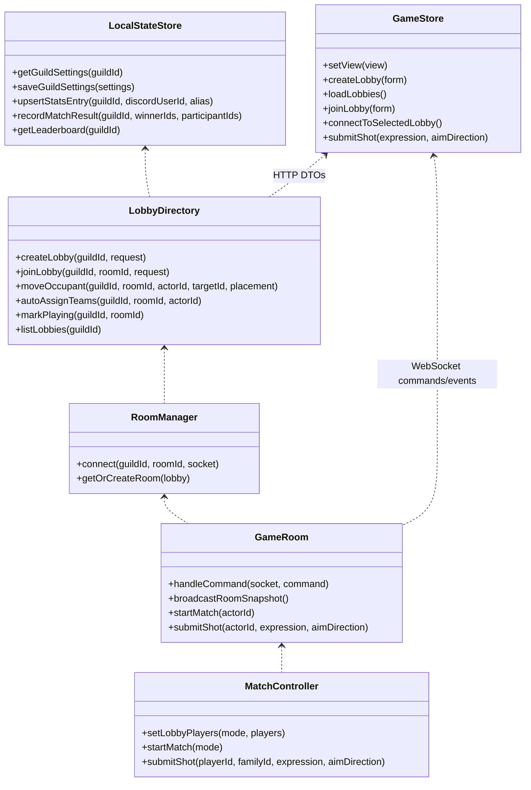

# Lobby Menu Flow Implementation Plan

> **For agentic workers:** REQUIRED SUB-SKILL: Use superpowers:subagent-driven-development (recommended) or superpowers:executing-plans to implement this plan task-by-task. Steps use checkbox (`- [ ]`) syntax for tracking.

**Goal:** Replace the direct developer room flow with a Discord-ready guild-scoped main menu, create/join lobby flow, lobby setup, spectator support, settings, and persistent leaderboard entries while preserving the authoritative local multiplayer game loop.

**Architecture:** Shared lobby DTOs and schemas define the HTTP and WebSocket contract. The server owns guild settings and leaderboard persistence through a JSON-backed store, while runtime lobbies remain in memory and feed the existing `MatchController`. The client starts in menu views, uses HTTP for menu/lobby/settings/leaderboard screens, opens a WebSocket only after a lobby is selected, and hides gameplay controls outside active player turns.

**Tech Stack:** TypeScript npm workspaces, React + Vite, Zustand, Fastify, `ws`, Zod, Node `fs/promises`, Vitest, Playwright.

---

## Architecture Map



## File Structure

- Create `packages/shared/src/lobby/types.ts`: guild/lobby/settings/leaderboard DTOs used by HTTP, WebSocket metadata, server internals, and client store.
- Create `packages/shared/src/lobby/alias.ts`: canonical alias normalization and duplicate comparison.
- Create `packages/shared/src/lobby/schemas.ts`: Zod schemas for lobby HTTP requests/responses and runtime lobby snapshots.
- Modify `packages/shared/src/index.ts`: export lobby modules.
- Modify `packages/shared/src/protocol/commands.ts`: add guild-aware join, targetable placement movement, auto-assign, and spectator slot fields.
- Modify `packages/shared/src/protocol/events.ts`: attach `guildId` and optional lobby snapshot to room events.
- Modify `packages/shared/src/protocol/schemas.ts`: validate new command/event shapes and lobby schemas.
- Test `packages/shared/src/lobby/alias.test.ts` and `packages/shared/src/protocol/schemas.test.ts`.
- Create `apps/server/src/persistence/LocalStateStore.ts`: JSON persistence for guild settings and leaderboard stats.
- Test `apps/server/src/persistence/LocalStateStore.test.ts`: save/reload settings, create/update stats, match result increments.
- Create `apps/server/src/lobbies/LobbyDirectory.ts`: guild-scoped in-memory lobby records, alias validation, leader authority, slots, team placement, auto-assign, start validation.
- Test `apps/server/src/lobbies/LobbyDirectory.test.ts`: alias collisions, cross-guild allowances, leader checks, spectators, team movement, auto-assign.
- Modify `apps/server/src/modes/GameMode.ts`, `apps/server/src/modes/TeamVersusMode.ts`, and `apps/server/src/modes/FreeForAllMode.ts`: honor preassigned team ids when present.
- Modify `apps/server/src/match/MatchController.ts`: add `setLobbyPlayers()` and start only non-spectator players.
- Test `apps/server/src/match/MatchController.test.ts`: explicit team assignments and spectator exclusion.
- Modify `apps/server/src/rooms/GameRoom.ts`: command authority validation, lobby synchronization, spectator rejection, lobby snapshot broadcasting.
- Modify `apps/server/src/rooms/RoomManager.ts`: guild-scoped room lookup and directory integration.
- Modify `apps/server/src/index.ts`: add guild-scoped HTTP endpoints and `/guilds/:guildId/rooms/:roomId` WebSocket upgrade path, keeping `/rooms/:roomId` compatibility.
- Test `apps/server/src/rooms/RoomManager.integration.test.ts` and `apps/server/src/index.test.ts`: HTTP create/join/list/settings/leaderboard plus guild-scoped WebSocket.
- Modify `apps/client/src/sessions/localSession.ts`: read `guild`, `user`, and compatibility `mockPlayer`; stop requiring a room at first render.
- Modify `apps/client/src/networking/gameClient.ts`: build guild-scoped WebSocket URLs.
- Create `apps/client/src/networking/lobbyApi.ts`: typed fetch helpers for guild lobbies, settings, leaderboard, create, and join.
- Modify `apps/client/src/app/useGameStore.ts`: add app view state, HTTP actions, selected lobby session, spectator state, and deferred WebSocket connection.
- Create `apps/client/src/menu/MainMenu.tsx`: first screen actions.
- Create `apps/client/src/lobby/CreateLobbyView.tsx`: create lobby form.
- Create `apps/client/src/lobby/JoinLobbyView.tsx`: lobby browser and alias join/spectate form.
- Create `apps/client/src/lobby/LobbySetupView.tsx`: team/free-for-all roster setup, spectator box, auto-assign, leader-only start.
- Create `apps/client/src/settings/SettingsView.tsx`: persisted guild settings UI.
- Create `apps/client/src/leaderboard/LeaderboardView.tsx`: guild-scoped leaderboard table.
- Modify `apps/client/src/app/App.tsx`: route views and render `GameCanvas`/`MatchHud` only for `game`.
- Modify `apps/client/src/hud/MatchHud.tsx`: hide shot controls for spectators.
- Modify `apps/client/src/styles.css`: 16:9 no-scroll menu/setup/game layouts.
- Test client unit/render files under `apps/client/src/**`: local session, URL builder, lobby API, store, views, spectator HUD.
- Modify `apps/client/e2e/local-lobby.spec.ts`: make all mock clients use main menu create/join flow.
- Modify `README.md`: document new local create/join testing flow and checkpoint log.

## Shared Contract

### Task 1: Add Shared Lobby Types And Alias Helpers

**Files:**
- Create: `packages/shared/src/lobby/types.ts`
- Create: `packages/shared/src/lobby/alias.ts`
- Create: `packages/shared/src/lobby/alias.test.ts`
- Modify: `packages/shared/src/index.ts`

- [ ] **Step 1: Write failing alias tests**

```ts
import { describe, expect, it } from "vitest";
import { aliasesConflict, normalizeAlias } from "./alias";

describe("lobby alias helpers", () => {
  it("trims aliases and compares them case-insensitively", () => {
    expect(normalizeAlias("  Alice  ")).toBe("alice");
    expect(aliasesConflict(" ALICE ", "alice")).toBe(true);
    expect(aliasesConflict("Alice", "Bob")).toBe(false);
  });

  it("treats whitespace-only aliases as empty", () => {
    expect(normalizeAlias("   ")).toBe("");
  });
});
```

- [ ] **Step 2: Run the failing alias test**

Run: `npm test -- packages/shared/src/lobby/alias.test.ts`

Expected: fails with an import error for `packages/shared/src/lobby/alias.ts`.

- [ ] **Step 3: Add shared lobby types**

Create `packages/shared/src/lobby/types.ts`:

```ts
import type { MatchModeId, PlayerId, RoomId, TeamId } from "../state/types";

export type GuildId = string;
export type DiscordUserId = string;
export type LobbyStatus = "open" | "playing" | "ended";
export type LobbySlot = "player" | "spectator";
export type LobbyPlacementId = "team-a" | "team-b" | "players" | "spectator";

export type GuildSettings = {
  guildId: GuildId;
  defaultMode: MatchModeId;
  allowSpectators: boolean;
};

export type PlayerStatsEntry = {
  guildId: GuildId;
  discordUserId: DiscordUserId;
  lastAlias: string;
  gamesPlayed: number;
  wins: number;
  eliminations: number;
  damageDealt: number;
  updatedAt: string;
};

export type PersistedServerState = {
  guilds: Record<
    GuildId,
    {
      settings: GuildSettings;
      leaderboard: Record<DiscordUserId, PlayerStatsEntry>;
    }
  >;
};

export type LobbyOccupant = {
  discordUserId: DiscordUserId;
  playerId: PlayerId;
  alias: string;
  slot: LobbySlot;
  placement: LobbyPlacementId;
  connected: boolean;
  isLeader: boolean;
};

export type LobbyRuntimeSnapshot = {
  guildId: GuildId;
  roomId: RoomId;
  name: string;
  mode: MatchModeId;
  status: LobbyStatus;
  leaderDiscordUserId: DiscordUserId;
  occupants: LobbyOccupant[];
  canStart: boolean;
  startBlockedReason?: string;
  createdAt: string;
  startedAt?: string;
};

export type LobbySummary = {
  guildId: GuildId;
  roomId: RoomId;
  name: string;
  mode: MatchModeId;
  status: LobbyStatus;
  leaderAlias: string;
  leaderDiscordUserId: DiscordUserId;
  playerCount: number;
  spectatorCount: number;
  createdAt: string;
};

export type CreateLobbyRequest = {
  name: string;
  leaderDiscordUserId: DiscordUserId;
  alias: string;
  mode: MatchModeId;
  initialSlot: LobbySlot;
};

export type JoinLobbyRequest = {
  discordUserId: DiscordUserId;
  alias: string;
  slot: LobbySlot;
};

export type LobbyJoinResult = {
  lobby: LobbyRuntimeSnapshot;
  session: {
    guildId: GuildId;
    roomId: RoomId;
    discordUserId: DiscordUserId;
    playerId: PlayerId;
    alias: string;
    slot: LobbySlot;
  };
};

export type SetLobbyPlacementRequest = {
  actorDiscordUserId: DiscordUserId;
  targetDiscordUserId: DiscordUserId;
  placement: LobbyPlacementId;
};

export type AutoAssignTeamsRequest = {
  actorDiscordUserId: DiscordUserId;
};

export type LobbyHttpError = {
  error: string;
  code: "alias-empty" | "alias-taken" | "forbidden" | "not-found" | "invalid-lobby" | "invalid-settings";
};
```

- [ ] **Step 4: Add alias helpers**

Create `packages/shared/src/lobby/alias.ts`:

```ts
export function normalizeAlias(alias: string): string {
  return alias.trim().toLocaleLowerCase();
}

export function aliasesConflict(left: string, right: string): boolean {
  return normalizeAlias(left) === normalizeAlias(right);
}
```

- [ ] **Step 5: Export lobby modules**

Modify `packages/shared/src/index.ts` by adding:

```ts
export * from "./lobby/alias";
export * from "./lobby/types";
```

- [ ] **Step 6: Run the alias test**

Run: `npm test -- packages/shared/src/lobby/alias.test.ts`

Expected: passes all alias helper tests.

- [ ] **Step 7: Commit and push shared type checkpoint**

```bash
git add packages/shared/src/lobby packages/shared/src/index.ts
git commit -m "feat: add lobby shared types"
git push
```

Expected: commit and SSH push succeed on `feature/graphwar-prototype`.

### Task 2: Add Shared Lobby Schemas And Protocol Updates

**Files:**
- Create: `packages/shared/src/lobby/schemas.ts`
- Modify: `packages/shared/src/protocol/commands.ts`
- Modify: `packages/shared/src/protocol/events.ts`
- Modify: `packages/shared/src/protocol/schemas.ts`
- Modify: `packages/shared/src/protocol/schemas.test.ts`
- Modify: `packages/shared/src/index.ts`

- [ ] **Step 1: Add failing schema coverage**

Append these tests to `packages/shared/src/protocol/schemas.test.ts`:

```ts
import {
  createLobbyRequestSchema,
  joinLobbyRequestSchema,
  lobbyRuntimeSnapshotSchema,
  type ClientCommand,
  type ServerEvent
} from "@graphwar/shared";

it("validates create and join lobby HTTP payloads", () => {
  expect(
    createLobbyRequestSchema.parse({
      name: "Friday Graphwar",
      leaderDiscordUserId: "alice-id",
      alias: "Alice",
      mode: "team-versus",
      initialSlot: "player"
    })
  ).toMatchObject({ name: "Friday Graphwar", alias: "Alice" });

  expect(
    joinLobbyRequestSchema.parse({
      discordUserId: "bob-id",
      alias: "Bob",
      slot: "spectator"
    })
  ).toMatchObject({ discordUserId: "bob-id", slot: "spectator" });
});

it("validates guild-scoped lobby command and snapshot events", () => {
  const joinCommand: ClientCommand = {
    type: "join-room",
    guildId: "local-guild",
    roomId: "room-1",
    playerId: "alice-id",
    discordUserId: "alice-id",
    alias: "Alice",
    displayName: "Alice",
    slot: "player"
  };

  expect(clientCommandSchema.parse(joinCommand)).toEqual(joinCommand);

  const event: ServerEvent = {
    type: "room-snapshot",
    guildId: "local-guild",
    roomId: "room-1",
    lobby: {
      guildId: "local-guild",
      roomId: "room-1",
      name: "Friday Graphwar",
      mode: "team-versus",
      status: "open",
      leaderDiscordUserId: "alice-id",
      occupants: [
        {
          discordUserId: "alice-id",
          playerId: "alice-id",
          alias: "Alice",
          slot: "player",
          placement: "team-a",
          connected: true,
          isLeader: true
        }
      ],
      canStart: false,
      startBlockedReason: "Team B needs at least one player.",
      createdAt: "2026-07-05T00:00:00.000Z"
    },
    snapshot
  };

  expect(serverEventSchema.parse(event)).toEqual(event);
  expect(lobbyRuntimeSnapshotSchema.parse(event.lobby)).toEqual(event.lobby);
});
```

- [ ] **Step 2: Run the failing schema tests**

Run: `npm test -- packages/shared/src/protocol/schemas.test.ts`

Expected: fails because `createLobbyRequestSchema`, `joinLobbyRequestSchema`, lobby event fields, and command fields are not exported or validated.

- [ ] **Step 3: Add lobby schemas**

Create `packages/shared/src/lobby/schemas.ts`:

```ts
import { z } from "zod";
import { aimDirections } from "../state/types";

export const lobbyStatusSchema = z.enum(["open", "playing", "ended"]);
export const lobbySlotSchema = z.enum(["player", "spectator"]);
export const lobbyPlacementSchema = z.enum(["team-a", "team-b", "players", "spectator"]);
export const matchModeSchema = z.enum(["team-versus", "free-for-all"]);

export const guildSettingsSchema = z.object({
  guildId: z.string().min(1),
  defaultMode: matchModeSchema,
  allowSpectators: z.boolean()
});

export const playerStatsEntrySchema = z.object({
  guildId: z.string().min(1),
  discordUserId: z.string().min(1),
  lastAlias: z.string().min(1),
  gamesPlayed: z.number().int().nonnegative(),
  wins: z.number().int().nonnegative(),
  eliminations: z.number().int().nonnegative(),
  damageDealt: z.number().finite().nonnegative(),
  updatedAt: z.string().datetime()
});

export const createLobbyRequestSchema = z.object({
  name: z.string().trim().min(1).max(80),
  leaderDiscordUserId: z.string().trim().min(1),
  alias: z.string().trim().min(1).max(24),
  mode: matchModeSchema,
  initialSlot: lobbySlotSchema
});

export const joinLobbyRequestSchema = z.object({
  discordUserId: z.string().trim().min(1),
  alias: z.string().trim().min(1).max(24),
  slot: lobbySlotSchema
});

export const lobbyOccupantSchema = z.object({
  discordUserId: z.string().min(1),
  playerId: z.string().min(1),
  alias: z.string().min(1),
  slot: lobbySlotSchema,
  placement: lobbyPlacementSchema,
  connected: z.boolean(),
  isLeader: z.boolean()
});

export const lobbyRuntimeSnapshotSchema = z.object({
  guildId: z.string().min(1),
  roomId: z.string().min(1),
  name: z.string().min(1),
  mode: matchModeSchema,
  status: lobbyStatusSchema,
  leaderDiscordUserId: z.string().min(1),
  occupants: z.array(lobbyOccupantSchema),
  canStart: z.boolean(),
  startBlockedReason: z.string().optional(),
  createdAt: z.string().datetime(),
  startedAt: z.string().datetime().optional()
});

export const lobbySummarySchema = z.object({
  guildId: z.string().min(1),
  roomId: z.string().min(1),
  name: z.string().min(1),
  mode: matchModeSchema,
  status: lobbyStatusSchema,
  leaderAlias: z.string().min(1),
  leaderDiscordUserId: z.string().min(1),
  playerCount: z.number().int().nonnegative(),
  spectatorCount: z.number().int().nonnegative(),
  createdAt: z.string().datetime()
});

export const lobbyJoinResultSchema = z.object({
  lobby: lobbyRuntimeSnapshotSchema,
  session: z.object({
    guildId: z.string().min(1),
    roomId: z.string().min(1),
    discordUserId: z.string().min(1),
    playerId: z.string().min(1),
    alias: z.string().min(1),
    slot: lobbySlotSchema
  })
});

export const aimDirectionSchema = z.enum(aimDirections);
```

- [ ] **Step 4: Update command types**

Replace the command type definitions in `packages/shared/src/protocol/commands.ts` with:

```ts
import type {
  AimDirectionId,
  FunctionFamilyId,
  MatchModeId,
  PlayerId,
  RoomId
} from "../state/types";
import type { DiscordUserId, GuildId, LobbyPlacementId, LobbySlot } from "../lobby/types";

export type JoinRoomCommand = {
  type: "join-room";
  guildId?: GuildId;
  roomId: RoomId;
  playerId: PlayerId;
  discordUserId?: DiscordUserId;
  alias?: string;
  displayName: string;
  slot?: LobbySlot;
};
export type SelectModeCommand = {
  type: "select-mode";
  guildId?: GuildId;
  roomId: RoomId;
  playerId: PlayerId;
  mode: MatchModeId;
};
export type SetTeamCommand = {
  type: "set-team";
  guildId?: GuildId;
  roomId: RoomId;
  playerId: PlayerId;
  targetPlayerId: PlayerId;
  placement: LobbyPlacementId;
};
export type AutoAssignTeamsCommand = {
  type: "auto-assign-teams";
  guildId?: GuildId;
  roomId: RoomId;
  playerId: PlayerId;
};
export type StartMatchCommand = { type: "start-match"; guildId?: GuildId; roomId: RoomId; playerId: PlayerId };
export type SubmitShotCommand = {
  type: "submit-shot";
  guildId?: GuildId;
  roomId: RoomId;
  playerId: PlayerId;
  functionFamilyId: FunctionFamilyId;
  aimDirection: AimDirectionId;
  expression: string;
};
export type SendChatCommand = { type: "send-chat"; guildId?: GuildId; roomId: RoomId; playerId: PlayerId; message: string };
export type RequestRematchCommand = { type: "request-rematch"; guildId?: GuildId; roomId: RoomId; playerId: PlayerId };

export type ClientCommand =
  | JoinRoomCommand
  | SelectModeCommand
  | SetTeamCommand
  | AutoAssignTeamsCommand
  | StartMatchCommand
  | SubmitShotCommand
  | SendChatCommand
  | RequestRematchCommand;
```

- [ ] **Step 5: Update event types**

In `packages/shared/src/protocol/events.ts`, update imports and `RoomSnapshotEvent`:

```ts
import type { LobbyRuntimeSnapshot, GuildId } from "../lobby/types";

export type RoomSnapshotEvent = {
  type: "room-snapshot";
  guildId?: GuildId;
  roomId: RoomId;
  snapshot: MatchSnapshot;
  lobby?: LobbyRuntimeSnapshot;
};
```

Then add `guildId?: GuildId` and `lobby?: LobbyRuntimeSnapshot` to `match-started`, `shot-resolved`, and `match-ended` event types. Leave older event payloads schema-valid by keeping `guildId` optional.

- [ ] **Step 6: Update protocol schemas**

In `packages/shared/src/protocol/schemas.ts`, import schemas from `../lobby/schemas`, reuse `matchModeSchema`, `lobbySlotSchema`, `lobbyPlacementSchema`, `lobbyRuntimeSnapshotSchema`, and validate the new commands:

```ts
const optionalGuildIdSchema = z.string().min(1).optional();

z.object({
  type: z.literal("join-room"),
  guildId: optionalGuildIdSchema,
  roomId: z.string(),
  playerId: z.string(),
  discordUserId: z.string().optional(),
  alias: z.string().optional(),
  displayName: z.string(),
  slot: lobbySlotSchema.optional()
});

z.object({
  type: z.literal("set-team"),
  guildId: optionalGuildIdSchema,
  roomId: z.string(),
  playerId: z.string(),
  targetPlayerId: z.string(),
  placement: lobbyPlacementSchema
});

z.object({
  type: z.literal("auto-assign-teams"),
  guildId: optionalGuildIdSchema,
  roomId: z.string(),
  playerId: z.string()
});
```

For `room-snapshot`, `match-started`, `shot-resolved`, and `match-ended`, add:

```ts
guildId: optionalGuildIdSchema,
lobby: lobbyRuntimeSnapshotSchema.optional()
```

- [ ] **Step 7: Export schemas**

Modify `packages/shared/src/index.ts` by adding:

```ts
export * from "./lobby/schemas";
```

- [ ] **Step 8: Run shared protocol tests**

Run: `npm test -- packages/shared/src/protocol/schemas.test.ts packages/shared/src/lobby/alias.test.ts`

Expected: both shared test files pass.

- [ ] **Step 9: Commit and push protocol checkpoint**

```bash
git add packages/shared/src/lobby packages/shared/src/protocol packages/shared/src/index.ts
git commit -m "feat: add lobby protocol contracts"
git push
```

Expected: commit and SSH push succeed.

## Server Persistence And Lobby Runtime

### Task 3: Add Server Local State Persistence

**Files:**
- Create: `apps/server/src/persistence/LocalStateStore.ts`
- Create: `apps/server/src/persistence/LocalStateStore.test.ts`
- Create: `apps/server/data/.gitkeep`
- Modify: `.gitignore`

- [ ] **Step 1: Write failing persistence tests**

Create `apps/server/src/persistence/LocalStateStore.test.ts`:

```ts
import { mkdtemp, readFile, rm } from "node:fs/promises";
import { join } from "node:path";
import { tmpdir } from "node:os";
import { afterEach, describe, expect, it } from "vitest";
import { LocalStateStore } from "./LocalStateStore";

const tempDirs: string[] = [];

async function createStore(): Promise<{ store: LocalStateStore; filePath: string }> {
  const dir = await mkdtemp(join(tmpdir(), "graphwar-state-"));
  tempDirs.push(dir);
  const filePath = join(dir, "local-state.json");
  return { store: new LocalStateStore(filePath), filePath };
}

describe("LocalStateStore", () => {
  afterEach(async () => {
    await Promise.all(tempDirs.splice(0).map((dir) => rm(dir, { recursive: true, force: true })));
  });

  it("persists guild settings and reloads them", async () => {
    const { store, filePath } = await createStore();

    await store.saveGuildSettings({ guildId: "guild-1", defaultMode: "free-for-all", allowSpectators: false });
    const reloaded = new LocalStateStore(filePath);

    await expect(reloaded.getGuildSettings("guild-1")).resolves.toEqual({
      guildId: "guild-1",
      defaultMode: "free-for-all",
      allowSpectators: false
    });
  });

  it("creates and updates leaderboard entries by guild and discord user id", async () => {
    const { store, filePath } = await createStore();

    await store.upsertStatsEntry("guild-1", "alice-id", "Alice");
    await store.upsertStatsEntry("guild-1", "alice-id", "Captain Alice");
    await store.upsertStatsEntry("guild-2", "alice-id", "Other Alice");
    const raw = JSON.parse(await readFile(filePath, "utf8"));

    expect(raw.guilds["guild-1"].leaderboard["alice-id"].lastAlias).toBe("Captain Alice");
    expect(raw.guilds["guild-1"].leaderboard["alice-id"].gamesPlayed).toBe(0);
    expect(raw.guilds["guild-2"].leaderboard["alice-id"].lastAlias).toBe("Other Alice");
  });

  it("increments games played and wins for match results", async () => {
    const { store } = await createStore();
    await store.upsertStatsEntry("guild-1", "alice-id", "Alice");
    await store.upsertStatsEntry("guild-1", "bob-id", "Bob");

    await store.recordMatchResult("guild-1", ["alice-id"], ["alice-id", "bob-id"]);
    const leaderboard = await store.getLeaderboard("guild-1");

    expect(leaderboard.find((entry) => entry.discordUserId === "alice-id")).toMatchObject({
      gamesPlayed: 1,
      wins: 1
    });
    expect(leaderboard.find((entry) => entry.discordUserId === "bob-id")).toMatchObject({
      gamesPlayed: 1,
      wins: 0
    });
  });
});
```

- [ ] **Step 2: Run the failing persistence test**

Run: `npm test -- apps/server/src/persistence/LocalStateStore.test.ts`

Expected: fails with an import error for `LocalStateStore`.

- [ ] **Step 3: Implement the JSON-backed store**

Create `apps/server/src/persistence/LocalStateStore.ts`:

```ts
import { mkdir, readFile, writeFile } from "node:fs/promises";
import { dirname } from "node:path";
import type { GuildSettings, PersistedServerState, PlayerStatsEntry } from "@graphwar/shared";

function defaultSettings(guildId: string): GuildSettings {
  return { guildId, defaultMode: "team-versus", allowSpectators: true };
}

function emptyState(): PersistedServerState {
  return { guilds: {} };
}

function nowIso(): string {
  return new Date().toISOString();
}

export class LocalStateStore {
  constructor(private readonly filePath = "apps/server/data/local-state.json") {}

  async getGuildSettings(guildId: string): Promise<GuildSettings> {
    const state = await this.readState();
    return state.guilds[guildId]?.settings ?? defaultSettings(guildId);
  }

  async saveGuildSettings(settings: GuildSettings): Promise<GuildSettings> {
    const state = await this.readState();
    const guild = (state.guilds[settings.guildId] ??= {
      settings: defaultSettings(settings.guildId),
      leaderboard: {}
    });
    guild.settings = settings;
    await this.writeState(state);
    return settings;
  }

  async upsertStatsEntry(guildId: string, discordUserId: string, alias: string): Promise<PlayerStatsEntry> {
    const state = await this.readState();
    const guild = (state.guilds[guildId] ??= { settings: defaultSettings(guildId), leaderboard: {} });
    const existing = guild.leaderboard[discordUserId];
    const entry: PlayerStatsEntry = {
      guildId,
      discordUserId,
      lastAlias: alias,
      gamesPlayed: existing?.gamesPlayed ?? 0,
      wins: existing?.wins ?? 0,
      eliminations: existing?.eliminations ?? 0,
      damageDealt: existing?.damageDealt ?? 0,
      updatedAt: nowIso()
    };
    guild.leaderboard[discordUserId] = entry;
    await this.writeState(state);
    return entry;
  }

  async recordMatchResult(guildId: string, winnerIds: string[], participantIds: string[]): Promise<void> {
    const state = await this.readState();
    const guild = (state.guilds[guildId] ??= { settings: defaultSettings(guildId), leaderboard: {} });
    const winners = new Set(winnerIds);
    for (const participantId of participantIds) {
      const existing =
        guild.leaderboard[participantId] ??
        ({
          guildId,
          discordUserId: participantId,
          lastAlias: participantId,
          gamesPlayed: 0,
          wins: 0,
          eliminations: 0,
          damageDealt: 0,
          updatedAt: nowIso()
        } satisfies PlayerStatsEntry);
      guild.leaderboard[participantId] = {
        ...existing,
        gamesPlayed: existing.gamesPlayed + 1,
        wins: existing.wins + (winners.has(participantId) ? 1 : 0),
        updatedAt: nowIso()
      };
    }
    await this.writeState(state);
  }

  async getLeaderboard(guildId: string): Promise<PlayerStatsEntry[]> {
    const state = await this.readState();
    return Object.values(state.guilds[guildId]?.leaderboard ?? {}).sort((left, right) => {
      if (right.wins !== left.wins) {
        return right.wins - left.wins;
      }
      return right.gamesPlayed - left.gamesPlayed;
    });
  }

  private async readState(): Promise<PersistedServerState> {
    try {
      return JSON.parse(await readFile(this.filePath, "utf8")) as PersistedServerState;
    } catch (error) {
      const code = typeof error === "object" && error && "code" in error ? error.code : undefined;
      if (code === "ENOENT") {
        return emptyState();
      }
      throw error;
    }
  }

  private async writeState(state: PersistedServerState): Promise<void> {
    await mkdir(dirname(this.filePath), { recursive: true });
    await writeFile(this.filePath, `${JSON.stringify(state, null, 2)}\n`, "utf8");
  }
}
```

- [ ] **Step 4: Ignore generated local state**

Add to `.gitignore`:

```gitignore
apps/server/data/local-state.json
```

Add an empty tracked marker at `apps/server/data/.gitkeep`.

- [ ] **Step 5: Run persistence tests**

Run: `npm test -- apps/server/src/persistence/LocalStateStore.test.ts`

Expected: all `LocalStateStore` tests pass.

- [ ] **Step 6: Commit and push persistence checkpoint**

```bash
git add .gitignore apps/server/data/.gitkeep apps/server/src/persistence
git commit -m "feat: persist guild settings and stats"
git push
```

Expected: commit and SSH push succeed.

### Task 4: Add Guild-Scoped Lobby Directory

**Files:**
- Create: `apps/server/src/lobbies/LobbyDirectory.ts`
- Create: `apps/server/src/lobbies/LobbyDirectory.test.ts`

- [ ] **Step 1: Write failing lobby directory tests**

Create `apps/server/src/lobbies/LobbyDirectory.test.ts`:

```ts
import { describe, expect, it } from "vitest";
import { LobbyDirectory } from "./LobbyDirectory";

function createDirectory(): LobbyDirectory {
  return new LobbyDirectory({
    now: () => new Date("2026-07-05T00:00:00.000Z"),
    createRoomId: () => "room-1",
    upsertStatsEntry: async () => undefined
  });
}

describe("LobbyDirectory", () => {
  it("creates a lobby with the creator as leader", async () => {
    const directory = createDirectory();
    const result = await directory.createLobby("guild-1", {
      name: "Friday Graphwar",
      leaderDiscordUserId: "alice-id",
      alias: "Alice",
      mode: "team-versus",
      initialSlot: "player"
    });

    expect(result.session).toMatchObject({ guildId: "guild-1", roomId: "room-1", alias: "Alice", slot: "player" });
    expect(result.lobby.occupants[0]).toMatchObject({
      discordUserId: "alice-id",
      alias: "Alice",
      placement: "team-a",
      isLeader: true
    });
  });

  it("rejects duplicate aliases in the same lobby and allows them elsewhere", async () => {
    const directory = createDirectory();
    await directory.createLobby("guild-1", {
      name: "Lobby One",
      leaderDiscordUserId: "alice-id",
      alias: "Alice",
      mode: "team-versus",
      initialSlot: "player"
    });

    await expect(
      directory.joinLobby("guild-1", "room-1", { discordUserId: "bob-id", alias: " alice ", slot: "player" })
    ).rejects.toThrow("Alias is already taken.");

    await directory.createLobby("guild-2", {
      name: "Lobby Two",
      leaderDiscordUserId: "charlie-id",
      alias: "Alice",
      mode: "team-versus",
      initialSlot: "player"
    });
    expect(directory.listLobbies("guild-2")).toHaveLength(1);
  });

  it("lets only the leader start and auto-assign team-versus lobbies", async () => {
    const directory = createDirectory();
    await directory.createLobby("guild-1", {
      name: "Teams",
      leaderDiscordUserId: "alice-id",
      alias: "Alice",
      mode: "team-versus",
      initialSlot: "player"
    });
    await directory.joinLobby("guild-1", "room-1", { discordUserId: "bob-id", alias: "Bob", slot: "player" });

    expect(() => directory.assertCanStart("guild-1", "room-1", "bob-id")).toThrow("Only the lobby leader can start.");

    const assigned = directory.autoAssignTeams("guild-1", "room-1", "alice-id");
    expect(assigned.occupants.map((occupant) => [occupant.alias, occupant.placement])).toEqual([
      ["Alice", "team-a"],
      ["Bob", "team-b"]
    ]);
    expect(directory.assertCanStart("guild-1", "room-1", "alice-id").canStart).toBe(true);
  });

  it("moves players and spectators with leader or self authority", async () => {
    const directory = createDirectory();
    await directory.createLobby("guild-1", {
      name: "Teams",
      leaderDiscordUserId: "alice-id",
      alias: "Alice",
      mode: "team-versus",
      initialSlot: "player"
    });
    await directory.joinLobby("guild-1", "room-1", { discordUserId: "bob-id", alias: "Bob", slot: "player" });

    expect(() => directory.moveOccupant("guild-1", "room-1", "charlie-id", "bob-id", "spectator")).toThrow(
      "Only the lobby leader can move another player."
    );

    const moved = directory.moveOccupant("guild-1", "room-1", "bob-id", "bob-id", "spectator");
    expect(moved.occupants.find((occupant) => occupant.alias === "Bob")).toMatchObject({
      slot: "spectator",
      placement: "spectator"
    });
  });

  it("allows started lobbies to be joined only as spectators", async () => {
    const directory = createDirectory();
    await directory.createLobby("guild-1", {
      name: "Started",
      leaderDiscordUserId: "alice-id",
      alias: "Alice",
      mode: "free-for-all",
      initialSlot: "player"
    });
    await directory.joinLobby("guild-1", "room-1", { discordUserId: "bob-id", alias: "Bob", slot: "player" });
    directory.markPlaying("guild-1", "room-1");

    await expect(
      directory.joinLobby("guild-1", "room-1", { discordUserId: "charlie-id", alias: "Charlie", slot: "player" })
    ).rejects.toThrow("Started lobbies can only be joined as a spectator.");

    await expect(
      directory.joinLobby("guild-1", "room-1", { discordUserId: "charlie-id", alias: "Charlie", slot: "spectator" })
    ).resolves.toMatchObject({ session: { slot: "spectator" } });
  });
});
```

- [ ] **Step 2: Run the failing lobby directory tests**

Run: `npm test -- apps/server/src/lobbies/LobbyDirectory.test.ts`

Expected: fails with an import error for `LobbyDirectory`.

- [ ] **Step 3: Implement lobby directory**

Create `apps/server/src/lobbies/LobbyDirectory.ts` with these public methods and exact error strings used by tests:

```ts
import { randomUUID } from "node:crypto";
import {
  aliasesConflict,
  type CreateLobbyRequest,
  type GuildId,
  type JoinLobbyRequest,
  type LobbyJoinResult,
  type LobbyOccupant,
  type LobbyPlacementId,
  type LobbyRuntimeSnapshot,
  type LobbySlot,
  type LobbySummary,
  type MatchModeId,
  type RoomId
} from "@graphwar/shared";

type LobbyRecord = {
  guildId: GuildId;
  roomId: RoomId;
  name: string;
  mode: MatchModeId;
  status: "open" | "playing" | "ended";
  leaderDiscordUserId: string;
  occupants: Map<string, LobbyOccupant>;
  createdAt: string;
  startedAt?: string;
};

type LobbyDirectoryOptions = {
  now?: () => Date;
  createRoomId?: () => string;
  upsertStatsEntry?: (guildId: string, discordUserId: string, alias: string) => Promise<unknown>;
};

export class LobbyDirectory {
  private readonly lobbies = new Map<string, LobbyRecord>();
  private readonly now: () => Date;
  private readonly createRoomId: () => string;
  private readonly upsertStatsEntry: (guildId: string, discordUserId: string, alias: string) => Promise<unknown>;

  constructor(options: LobbyDirectoryOptions = {}) {
    this.now = options.now ?? (() => new Date());
    this.createRoomId = options.createRoomId ?? (() => randomUUID().slice(0, 8));
    this.upsertStatsEntry = options.upsertStatsEntry ?? (async () => undefined);
  }

  async createLobby(guildId: string, request: CreateLobbyRequest): Promise<LobbyJoinResult> {
    const roomId = this.createRoomId();
    const record: LobbyRecord = {
      guildId,
      roomId,
      name: request.name.trim(),
      mode: request.mode,
      status: "open",
      leaderDiscordUserId: request.leaderDiscordUserId,
      occupants: new Map(),
      createdAt: this.now().toISOString()
    };
    this.lobbies.set(this.key(guildId, roomId), record);
    await this.addOrUpdateOccupant(record, request.leaderDiscordUserId, request.alias, request.initialSlot);
    return this.joinResult(record, request.leaderDiscordUserId);
  }

  async joinLobby(guildId: string, roomId: string, request: JoinLobbyRequest): Promise<LobbyJoinResult> {
    const record = this.requireLobby(guildId, roomId);
    if (record.status === "playing" && request.slot !== "spectator") {
      throw new Error("Started lobbies can only be joined as a spectator.");
    }
    await this.addOrUpdateOccupant(record, request.discordUserId, request.alias, request.slot);
    return this.joinResult(record, request.discordUserId);
  }

  listLobbies(guildId: string): LobbySummary[] {
    return Array.from(this.lobbies.values())
      .filter((record) => record.guildId === guildId)
      .map((record) => this.summary(record));
  }

  getLobby(guildId: string, roomId: string): LobbyRuntimeSnapshot {
    return this.snapshot(this.requireLobby(guildId, roomId));
  }

  moveOccupant(guildId: string, roomId: string, actorId: string, targetId: string, placement: LobbyPlacementId): LobbyRuntimeSnapshot {
    const record = this.requireLobby(guildId, roomId);
    this.assertMoveAuthority(record, actorId, targetId);
    const occupant = this.requireOccupant(record, targetId);
    const nextSlot: LobbySlot = placement === "spectator" ? "spectator" : "player";
    record.occupants.set(targetId, { ...occupant, slot: nextSlot, placement });
    return this.snapshot(record);
  }

  autoAssignTeams(guildId: string, roomId: string, actorId: string): LobbyRuntimeSnapshot {
    const record = this.requireLobby(guildId, roomId);
    this.assertLeader(record, actorId);
    const players = Array.from(record.occupants.values()).filter((occupant) => occupant.slot === "player");
    players.forEach((occupant, index) => {
      record.occupants.set(occupant.discordUserId, {
        ...occupant,
        placement: index % 2 === 0 ? "team-a" : "team-b"
      });
    });
    return this.snapshot(record);
  }

  assertCanStart(guildId: string, roomId: string, actorId: string): { canStart: true } {
    const record = this.requireLobby(guildId, roomId);
    this.assertLeader(record, actorId);
    const blocked = this.startBlockedReason(record);
    if (blocked) {
      throw new Error(blocked);
    }
    return { canStart: true };
  }

  markPlaying(guildId: string, roomId: string): LobbyRuntimeSnapshot {
    const record = this.requireLobby(guildId, roomId);
    record.status = "playing";
    record.startedAt = this.now().toISOString();
    return this.snapshot(record);
  }

  playerOccupants(guildId: string, roomId: string): LobbyOccupant[] {
    return this.snapshot(this.requireLobby(guildId, roomId)).occupants.filter((occupant) => occupant.slot === "player");
  }

  private async addOrUpdateOccupant(record: LobbyRecord, discordUserId: string, alias: string, slot: LobbySlot): Promise<void> {
    const trimmedAlias = alias.trim();
    if (!trimmedAlias) {
      throw new Error("Alias is required.");
    }
    for (const occupant of record.occupants.values()) {
      if (occupant.discordUserId !== discordUserId && aliasesConflict(occupant.alias, trimmedAlias)) {
        throw new Error("Alias is already taken.");
      }
    }
    const existing = record.occupants.get(discordUserId);
    const placement = this.defaultPlacement(record, slot, existing?.placement);
    record.occupants.set(discordUserId, {
      discordUserId,
      playerId: discordUserId,
      alias: trimmedAlias,
      slot,
      placement,
      connected: existing?.connected ?? false,
      isLeader: discordUserId === record.leaderDiscordUserId
    });
    await this.upsertStatsEntry(record.guildId, discordUserId, trimmedAlias);
  }

  private defaultPlacement(record: LobbyRecord, slot: LobbySlot, previous?: LobbyPlacementId): LobbyPlacementId {
    if (slot === "spectator") {
      return "spectator";
    }
    if (previous && previous !== "spectator") {
      return previous;
    }
    if (record.mode === "free-for-all") {
      return "players";
    }
    const counts = { "team-a": 0, "team-b": 0 };
    for (const occupant of record.occupants.values()) {
      if (occupant.placement === "team-a" || occupant.placement === "team-b") {
        counts[occupant.placement] += 1;
      }
    }
    return counts["team-a"] <= counts["team-b"] ? "team-a" : "team-b";
  }

  private startBlockedReason(record: LobbyRecord): string | undefined {
    const players = Array.from(record.occupants.values()).filter((occupant) => occupant.slot === "player");
    if (record.mode === "free-for-all") {
      return players.length >= 2 ? undefined : "Free for all needs at least two players.";
    }
    const teamA = players.some((occupant) => occupant.placement === "team-a");
    const teamB = players.some((occupant) => occupant.placement === "team-b");
    if (!teamA) return "Team A needs at least one player.";
    if (!teamB) return "Team B needs at least one player.";
    return undefined;
  }

  private snapshot(record: LobbyRecord): LobbyRuntimeSnapshot {
    const blocked = this.startBlockedReason(record);
    return {
      guildId: record.guildId,
      roomId: record.roomId,
      name: record.name,
      mode: record.mode,
      status: record.status,
      leaderDiscordUserId: record.leaderDiscordUserId,
      occupants: Array.from(record.occupants.values()),
      canStart: record.status === "open" && !blocked,
      ...(blocked ? { startBlockedReason: blocked } : {}),
      createdAt: record.createdAt,
      ...(record.startedAt ? { startedAt: record.startedAt } : {})
    };
  }

  private summary(record: LobbyRecord): LobbySummary {
    const occupants = Array.from(record.occupants.values());
    const leader = occupants.find((occupant) => occupant.discordUserId === record.leaderDiscordUserId);
    return {
      guildId: record.guildId,
      roomId: record.roomId,
      name: record.name,
      mode: record.mode,
      status: record.status,
      leaderAlias: leader?.alias ?? record.leaderDiscordUserId,
      leaderDiscordUserId: record.leaderDiscordUserId,
      playerCount: occupants.filter((occupant) => occupant.slot === "player").length,
      spectatorCount: occupants.filter((occupant) => occupant.slot === "spectator").length,
      createdAt: record.createdAt
    };
  }

  private joinResult(record: LobbyRecord, discordUserId: string): LobbyJoinResult {
    const occupant = this.requireOccupant(record, discordUserId);
    return {
      lobby: this.snapshot(record),
      session: {
        guildId: record.guildId,
        roomId: record.roomId,
        discordUserId,
        playerId: discordUserId,
        alias: occupant.alias,
        slot: occupant.slot
      }
    };
  }

  private assertMoveAuthority(record: LobbyRecord, actorId: string, targetId: string): void {
    if (actorId === targetId) {
      return;
    }
    this.assertLeader(record, actorId, "Only the lobby leader can move another player.");
  }

  private assertLeader(record: LobbyRecord, actorId: string, message = "Only the lobby leader can start."): void {
    if (record.leaderDiscordUserId !== actorId) {
      throw new Error(message);
    }
  }

  private requireLobby(guildId: string, roomId: string): LobbyRecord {
    const record = this.lobbies.get(this.key(guildId, roomId));
    if (!record) {
      throw new Error("Lobby not found.");
    }
    return record;
  }

  private requireOccupant(record: LobbyRecord, discordUserId: string): LobbyOccupant {
    const occupant = record.occupants.get(discordUserId);
    if (!occupant) {
      throw new Error("Lobby occupant not found.");
    }
    return occupant;
  }

  private key(guildId: string, roomId: string): string {
    return `${guildId}:${roomId}`;
  }
}
```

- [ ] **Step 4: Run lobby directory tests**

Run: `npm test -- apps/server/src/lobbies/LobbyDirectory.test.ts`

Expected: all lobby directory tests pass.

- [ ] **Step 5: Commit and push lobby directory checkpoint**

```bash
git add apps/server/src/lobbies
git commit -m "feat: add guild lobby directory"
git push
```

Expected: commit and SSH push succeed.

### Task 5: Sync Lobby Placements Into MatchController

**Files:**
- Modify: `apps/server/src/modes/GameMode.ts`
- Modify: `apps/server/src/modes/TeamVersusMode.ts`
- Modify: `apps/server/src/modes/FreeForAllMode.ts`
- Modify: `apps/server/src/match/MatchController.ts`
- Modify: `apps/server/src/match/MatchController.test.ts`

- [ ] **Step 1: Add failing match tests**

Append to `apps/server/src/match/MatchController.test.ts`:

```ts
it("starts a team match using explicit lobby team placements", () => {
  const controller = new MatchController("room-1");
  controller.setLobbyPlayers("team-versus", [
    { id: "alice-id", displayName: "Alice", teamId: "team-b" },
    { id: "bob-id", displayName: "Bob", teamId: "team-a" }
  ]);

  const snapshot = controller.startMatch("team-versus");

  expect(snapshot.teams).toEqual([
    { id: "team-a", playerIds: ["bob-id"] },
    { id: "team-b", playerIds: ["alice-id"] }
  ]);
  expect(snapshot.players.find((player) => player.id === "alice-id")?.teamId).toBe("team-b");
});

it("rebuilds lobby snapshots from non-spectator lobby players only", () => {
  const controller = new MatchController("room-1");
  const snapshot = controller.setLobbyPlayers("free-for-all", [
    { id: "alice-id", displayName: "Alice" },
    { id: "bob-id", displayName: "Bob" }
  ]);

  expect(snapshot.players.map((player) => player.id)).toEqual(["alice-id", "bob-id"]);
  expect(snapshot.teams).toEqual([
    { id: "player-alice-id", playerIds: ["alice-id"] },
    { id: "player-bob-id", playerIds: ["bob-id"] }
  ]);
});
```

- [ ] **Step 2: Run failing match tests**

Run: `npm test -- apps/server/src/match/MatchController.test.ts`

Expected: fails because `setLobbyPlayers` and explicit `teamId` support do not exist.

- [ ] **Step 3: Extend mode lobby player type**

Modify `apps/server/src/modes/GameMode.ts`:

```ts
export type LobbyPlayer = { id: PlayerId; displayName: string; teamId?: TeamId };
```

- [ ] **Step 4: Honor explicit team-versus placements**

Modify `apps/server/src/modes/TeamVersusMode.ts`:

```ts
buildTeams(players: LobbyPlayer[]): TeamState[] {
  const explicitTeamPlayers = players.filter((player) => player.teamId === "team-a" || player.teamId === "team-b");
  if (explicitTeamPlayers.length === players.length && players.length > 0) {
    return ["team-a", "team-b"].map((teamId) => ({
      id: teamId,
      playerIds: players.filter((player) => player.teamId === teamId).map((player) => player.id)
    }));
  }

  return splitPlayerIdsByTeam(players.map((player) => player.id));
}
```

- [ ] **Step 5: Add `setLobbyPlayers` to `MatchController`**

In `apps/server/src/match/MatchController.ts`, add:

```ts
setLobbyPlayers(modeId: MatchModeId, players: LobbyPlayer[]): MatchState {
  if (this.snapshot.phase !== "lobby") {
    throw new Error("Match has already started");
  }

  this.lobbyPlayers.clear();
  for (const player of players) {
    this.lobbyPlayers.set(player.id, player);
  }
  this.snapshot = this.createLobbySnapshot(modeId);
  return this.getSnapshot();
}
```

Also keep `join()` by setting `{ id: playerId, displayName }` as before.

- [ ] **Step 6: Ensure player `teamId` comes from teams**

Keep `startMatch()` using `teamIdsByPlayerId(teams)` and `mode.buildTeams(lobbyPlayers)`, so explicit team placements become authoritative for map generation and victory logic.

- [ ] **Step 7: Run mode and match tests**

Run: `npm test -- apps/server/src/modes apps/server/src/match/MatchController.test.ts`

Expected: all mode and match controller tests pass.

- [ ] **Step 8: Commit and push match sync checkpoint**

```bash
git add apps/server/src/modes apps/server/src/match/MatchController.ts apps/server/src/match/MatchController.test.ts
git commit -m "feat: sync lobby placements into matches"
git push
```

Expected: commit and SSH push succeed.

### Task 6: Add HTTP Endpoints And Guild-Scoped WebSockets

**Files:**
- Modify: `apps/server/src/index.ts`
- Modify: `apps/server/src/index.test.ts`
- Modify: `apps/server/src/rooms/RoomManager.ts`
- Modify: `apps/server/src/rooms/GameRoom.ts`
- Modify: `apps/server/src/rooms/RoomManager.integration.test.ts`

- [ ] **Step 1: Add failing HTTP and WebSocket integration tests**

Append to `apps/server/src/rooms/RoomManager.integration.test.ts`:

```ts
function guildSocketUrl(app: TestServer, guildId: string, roomId: string): string {
  const address = app.server.address() as AddressInfo;
  return `ws://127.0.0.1:${address.port}/guilds/${guildId}/rooms/${roomId}`;
}

it("creates and joins a guild-scoped lobby through HTTP before opening websocket clients", async () => {
  const app = await startTestServer();

  const createResponse = await app.inject({
    method: "POST",
    url: "/guilds/local-guild/lobbies",
    payload: {
      name: "Friday Graphwar",
      leaderDiscordUserId: "alice-id",
      alias: "Alice",
      mode: "team-versus",
      initialSlot: "player"
    }
  });
  expect(createResponse.statusCode).toBe(201);
  const created = JSON.parse(createResponse.body);

  const duplicateResponse = await app.inject({
    method: "POST",
    url: `/guilds/local-guild/lobbies/${created.session.roomId}/join`,
    payload: { discordUserId: "bob-id", alias: "alice", slot: "player" }
  });
  expect(duplicateResponse.statusCode).toBe(409);

  const joinResponse = await app.inject({
    method: "POST",
    url: `/guilds/local-guild/lobbies/${created.session.roomId}/join`,
    payload: { discordUserId: "bob-id", alias: "Bob", slot: "player" }
  });
  expect(joinResponse.statusCode).toBe(200);

  const alice = await connect(guildSocketUrl(app, "local-guild", created.session.roomId));
  const bob = await connect(guildSocketUrl(app, "local-guild", created.session.roomId));
  const aliceEvents = collectEvents(alice);
  const bobEvents = collectEvents(bob);

  send(alice, {
    type: "join-room",
    guildId: "local-guild",
    roomId: created.session.roomId,
    playerId: "alice-id",
    discordUserId: "alice-id",
    alias: "Alice",
    displayName: "Alice",
    slot: "player"
  });
  send(bob, {
    type: "join-room",
    guildId: "local-guild",
    roomId: created.session.roomId,
    playerId: "bob-id",
    discordUserId: "bob-id",
    alias: "Bob",
    displayName: "Bob",
    slot: "player"
  });

  await waitForEvent(
    () => [...aliceEvents, ...bobEvents],
    (candidate) =>
      candidate.type === "room-snapshot" &&
      candidate.guildId === "local-guild" &&
      candidate.lobby?.occupants.length === 2
  );

  send(bob, { type: "start-match", guildId: "local-guild", roomId: created.session.roomId, playerId: "bob-id" });
  await waitForEvent(
    () => bobEvents,
    (candidate) => candidate.type === "shot-rejected" && candidate.reason === "Only the lobby leader can start."
  );

  send(alice, { type: "auto-assign-teams", guildId: "local-guild", roomId: created.session.roomId, playerId: "alice-id" });
  send(alice, { type: "start-match", guildId: "local-guild", roomId: created.session.roomId, playerId: "alice-id" });
  await waitForEvent(() => [...aliceEvents, ...bobEvents], (candidate) => candidate.type === "match-started");

  await closeSocket(alice);
  await closeSocket(bob);
});
```

- [ ] **Step 2: Run failing integration test**

Run: `npm test -- apps/server/src/rooms/RoomManager.integration.test.ts`

Expected: fails because HTTP endpoints, guild WebSocket path, and lobby commands are not wired.

- [ ] **Step 3: Wire server dependencies in `buildServer`**

In `apps/server/src/index.ts`, create shared instances:

```ts
const stateStore = new LocalStateStore();
const lobbies = new LobbyDirectory({
  upsertStatsEntry: (guildId, discordUserId, alias) => stateStore.upsertStatsEntry(guildId, discordUserId, alias)
});
const rooms = new RoomManager(lobbies, stateStore);
```

- [ ] **Step 4: Add HTTP routes**

Add routes in `apps/server/src/index.ts`:

```ts
app.get("/guilds/:guildId/lobbies", async (request) => {
  const { guildId } = request.params as { guildId: string };
  return lobbies.listLobbies(guildId);
});

app.post("/guilds/:guildId/lobbies", async (request, reply) => {
  const { guildId } = request.params as { guildId: string };
  const parsed = createLobbyRequestSchema.safeParse(request.body);
  if (!parsed.success) {
    return reply.code(400).send({ code: "invalid-lobby", error: parsed.error.message });
  }
  try {
    return reply.code(201).send(await lobbies.createLobby(guildId, parsed.data));
  } catch (error) {
    return reply.code(error instanceof Error && error.message.includes("Alias") ? 409 : 400).send({
      code: error instanceof Error && error.message.includes("Alias") ? "alias-taken" : "invalid-lobby",
      error: error instanceof Error ? error.message : "Lobby could not be created."
    });
  }
});

app.post("/guilds/:guildId/lobbies/:roomId/join", async (request, reply) => {
  const { guildId, roomId } = request.params as { guildId: string; roomId: string };
  const parsed = joinLobbyRequestSchema.safeParse(request.body);
  if (!parsed.success) {
    return reply.code(400).send({ code: "invalid-lobby", error: parsed.error.message });
  }
  try {
    return await lobbies.joinLobby(guildId, roomId, parsed.data);
  } catch (error) {
    const message = error instanceof Error ? error.message : "Lobby join failed.";
    const status = message.includes("taken") ? 409 : message.includes("not found") ? 404 : 400;
    return reply.code(status).send({ code: status === 409 ? "alias-taken" : "invalid-lobby", error: message });
  }
});

app.get("/guilds/:guildId/settings", async (request) => {
  const { guildId } = request.params as { guildId: string };
  return stateStore.getGuildSettings(guildId);
});

app.put("/guilds/:guildId/settings", async (request, reply) => {
  const { guildId } = request.params as { guildId: string };
  const parsed = guildSettingsSchema.safeParse({ ...(request.body as object), guildId });
  if (!parsed.success) {
    return reply.code(400).send({ code: "invalid-settings", error: parsed.error.message });
  }
  return stateStore.saveGuildSettings(parsed.data);
});

app.get("/guilds/:guildId/leaderboard", async (request) => {
  const { guildId } = request.params as { guildId: string };
  return stateStore.getLeaderboard(guildId);
});
```

- [ ] **Step 5: Parse guild-scoped WebSocket paths**

Replace `parseRoomId()` with:

```ts
function parseRoomPath(requestUrl: string | undefined): { guildId: string; roomId: string } | undefined {
  try {
    const url = new URL(requestUrl ?? "/", "http://localhost");
    const guildMatch = /^\/guilds\/([^/]+)\/rooms\/([^/]+)$/.exec(url.pathname);
    if (guildMatch) {
      return { guildId: decodeURIComponent(guildMatch[1]), roomId: decodeURIComponent(guildMatch[2]) };
    }
    const legacyMatch = /^\/rooms\/([^/]+)$/.exec(url.pathname);
    return legacyMatch ? { guildId: "local-guild", roomId: decodeURIComponent(legacyMatch[1]) } : undefined;
  } catch {
    return undefined;
  }
}
```

Use `rooms.connect(parsed.guildId, parsed.roomId, ws)`.

- [ ] **Step 6: Update `RoomManager` constructor and keying**

Change `apps/server/src/rooms/RoomManager.ts` constructor:

```ts
constructor(
  private readonly lobbies: LobbyDirectory = new LobbyDirectory(),
  private readonly stateStore: LocalStateStore = new LocalStateStore()
) {}
```

Change `rooms` map key to `${guildId}:${roomId}` and `connect(guildId, roomId, socket)`.

- [ ] **Step 7: Update `GameRoom` for lobby-aware commands**

In `apps/server/src/rooms/GameRoom.ts`, inject `guildId`, `LobbyDirectory`, and `LocalStateStore`. Add helpers:

```ts
private syncLobbySnapshot(): MatchSnapshot {
  const lobby = this.lobbies.getLobby(this.guildId, this.roomId);
  const players = lobby.occupants
    .filter((occupant) => occupant.slot === "player")
    .map((occupant) => ({
      id: occupant.playerId,
      displayName: occupant.alias,
      teamId: occupant.placement === "team-a" || occupant.placement === "team-b" ? occupant.placement : undefined
    }));
  return this.match.setLobbyPlayers(lobby.mode, players);
}

private broadcastRoomSnapshot(): void {
  const lobby = this.lobbies.getLobby(this.guildId, this.roomId);
  const snapshot = this.match.getSnapshot();
  this.broadcast({ type: "room-snapshot", guildId: this.guildId, roomId: this.roomId, lobby, snapshot });
}

private isSpectator(playerId: string): boolean {
  const lobby = this.lobbies.getLobby(this.guildId, this.roomId);
  return lobby.occupants.find((occupant) => occupant.playerId === playerId)?.slot === "spectator";
}
```

Command behavior:

```ts
case "join-room": {
  await this.lobbies.joinLobby(this.guildId, this.roomId, {
    discordUserId: command.discordUserId ?? command.playerId,
    alias: command.alias ?? command.displayName,
    slot: command.slot ?? "player"
  });
  this.syncLobbySnapshot();
  this.broadcast({ type: "player-joined", guildId: this.guildId, roomId: this.roomId, playerId: command.playerId });
  this.broadcastRoomSnapshot();
  return;
}
case "set-team": {
  this.lobbies.moveOccupant(this.guildId, this.roomId, command.playerId, command.targetPlayerId, command.placement);
  this.syncLobbySnapshot();
  this.broadcastRoomSnapshot();
  return;
}
case "auto-assign-teams": {
  this.lobbies.autoAssignTeams(this.guildId, this.roomId, command.playerId);
  this.syncLobbySnapshot();
  this.broadcastRoomSnapshot();
  return;
}
case "start-match": {
  this.lobbies.assertCanStart(this.guildId, this.roomId, command.playerId);
  const lobby = this.lobbies.markPlaying(this.guildId, this.roomId);
  const snapshot = this.match.startMatch(lobby.mode);
  this.broadcast({ type: "match-started", guildId: this.guildId, roomId: this.roomId, lobby, snapshot });
  this.broadcast({ type: "turn-started", guildId: this.guildId, roomId: this.roomId, playerId: snapshot.turn.activePlayerId, turnNumber: snapshot.turn.turnNumber });
  return;
}
case "submit-shot": {
  if (this.isSpectator(command.playerId)) {
    this.sendRejection(socket, command.playerId, "Spectators cannot submit shots.");
    return;
  }
  // Existing submit-shot path remains after this guard.
}
```

On `match-ended`, call:

```ts
await this.stateStore.recordMatchResult(this.guildId, event.winnerIds, event.snapshot.players.map((player) => player.id));
```

- [ ] **Step 8: Run server integration tests**

Run: `npm test -- apps/server/src/index.test.ts apps/server/src/rooms/RoomManager.integration.test.ts`

Expected: HTTP routes and guild WebSocket integration pass.

- [ ] **Step 9: Commit and push server route checkpoint**

```bash
git add apps/server/src/index.ts apps/server/src/index.test.ts apps/server/src/rooms apps/server/src/lobbies apps/server/src/persistence
git commit -m "feat: add guild lobby server flow"
git push
```

Expected: commit and SSH push succeed.

## Client Menu, Lobby, Settings, Leaderboard

### Task 7: Update Local Session And Networking Clients

**Files:**
- Modify: `apps/client/src/sessions/localSession.ts`
- Modify: `apps/client/src/sessions/localSession.test.ts`
- Modify: `apps/client/src/networking/gameClient.ts`
- Modify: `apps/client/src/networking/gameClient.test.ts`
- Create: `apps/client/src/networking/lobbyApi.ts`
- Create: `apps/client/src/networking/lobbyApi.test.ts`

- [ ] **Step 1: Add failing session and URL tests**

Update `apps/client/src/sessions/localSession.test.ts`:

```ts
it("reads guild and discord user identity from local testing query parameters", () => {
  const session = readLocalSession("http://localhost:5173/?guild=local-guild&user=alice-id&server=http://127.0.0.1:8787");

  expect(session).toMatchObject({
    guildId: "local-guild",
    discordUserId: "alice-id",
    playerId: "alice-id",
    source: "local",
    serverUrl: "http://127.0.0.1:8787"
  });
});

it("keeps mockPlayer as a compatibility identity shortcut", () => {
  const session = readLocalSession("http://localhost:5173/?mockPlayer=bob&displayName=Bob");

  expect(session.guildId).toBe("local-guild");
  expect(session.discordUserId).toBe("bob");
  expect(session.defaultAlias).toBe("Bob");
});
```

Update `apps/client/src/networking/gameClient.test.ts`:

```ts
it("builds guild-scoped websocket urls", () => {
  expect(
    buildRoomWebSocketUrl({
      guildId: "local-guild",
      roomId: "room 1",
      serverUrl: "http://127.0.0.1:8787/",
      locationHref: "http://localhost:5173/"
    })
  ).toBe("ws://127.0.0.1:8787/guilds/local-guild/rooms/room%201");
});
```

- [ ] **Step 2: Run failing client networking tests**

Run: `npm test -- apps/client/src/sessions/localSession.test.ts apps/client/src/networking/gameClient.test.ts`

Expected: fails because `guildId`, `discordUserId`, `defaultAlias`, and object-style `buildRoomWebSocketUrl` do not exist.

- [ ] **Step 3: Update `ClientSession`**

Modify `apps/client/src/sessions/localSession.ts`:

```ts
export type ClientSession = {
  guildId: string;
  discordUserId: string;
  playerId: string;
  defaultAlias: string;
  roomId?: string;
  displayName: string;
  serverUrl?: string;
  source: "local" | "discord";
};
```

In `readLocalSession()`, derive:

```ts
const guildId = readParam(url, "guild") ?? "local-guild";
const discordUserId = readParam(url, "user") ?? readParam(url, "mockPlayer") ?? readStableLocalPlayerId(storage);
const defaultAlias = readParam(url, "displayName") ?? discordUserId;
const roomId = readParam(url, "room");
```

Return `playerId: discordUserId`, `displayName: defaultAlias`, and include `roomId` only when present.

- [ ] **Step 4: Update WebSocket URL builder**

Change `apps/client/src/networking/gameClient.ts`:

```ts
export type BuildRoomWebSocketUrlOptions = {
  guildId?: string;
  roomId: string;
  serverUrl?: string;
  locationHref?: string;
};

export function buildRoomWebSocketUrl(options: BuildRoomWebSocketUrlOptions): string {
  const locationHref = options.locationHref ?? readLocationHref();
  const baseUrl = options.serverUrl
    ? normalizeServerUrl(options.serverUrl)
    : `ws://${new URL(locationHref, "http://localhost:5173/").hostname}:8787`;

  if (options.guildId) {
    return `${baseUrl}/guilds/${encodeURIComponent(options.guildId)}/rooms/${encodeURIComponent(options.roomId)}`;
  }

  return `${baseUrl}/rooms/${encodeURIComponent(options.roomId)}`;
}
```

Update `connectGameClient()` to call:

```ts
const url = buildRoomWebSocketUrl({
  guildId: options.guildId,
  roomId: options.roomId,
  serverUrl: options.serverUrl,
  locationHref: options.locationHref
});
```

Add `guildId?: string` to `ConnectGameClientOptions`.

- [ ] **Step 5: Add HTTP lobby API client**

Create `apps/client/src/networking/lobbyApi.ts`:

```ts
import {
  createLobbyRequestSchema,
  guildSettingsSchema,
  joinLobbyRequestSchema,
  lobbyJoinResultSchema,
  lobbySummarySchema,
  playerStatsEntrySchema,
  type CreateLobbyRequest,
  type GuildSettings,
  type JoinLobbyRequest,
  type LobbyJoinResult,
  type LobbySummary,
  type PlayerStatsEntry
} from "@graphwar/shared";

export type LobbyApi = ReturnType<typeof createLobbyApi>;

function httpBase(serverUrl: string | undefined, locationHref = window.location.href): string {
  if (serverUrl) {
    return serverUrl.replace(/^ws:/, "http:").replace(/^wss:/, "https:").replace(/\/+$/, "");
  }
  const url = new URL(locationHref, "http://localhost:5173/");
  return `http://${url.hostname}:8787`;
}

async function readJson<T>(response: Response, parse: (value: unknown) => T): Promise<T> {
  const payload = await response.json();
  if (!response.ok) {
    const error = new Error(typeof payload?.error === "string" ? payload.error : "Request failed.");
    (error as Error & { status?: number }).status = response.status;
    throw error;
  }
  return parse(payload);
}

export function createLobbyApi(serverUrl?: string, locationHref?: string) {
  const base = httpBase(serverUrl, locationHref);
  return {
    async listLobbies(guildId: string): Promise<LobbySummary[]> {
      const response = await fetch(`${base}/guilds/${encodeURIComponent(guildId)}/lobbies`);
      return readJson(response, (value) => lobbySummarySchema.array().parse(value));
    },
    async createLobby(guildId: string, request: CreateLobbyRequest): Promise<LobbyJoinResult> {
      const response = await fetch(`${base}/guilds/${encodeURIComponent(guildId)}/lobbies`, {
        method: "POST",
        headers: { "content-type": "application/json" },
        body: JSON.stringify(createLobbyRequestSchema.parse(request))
      });
      return readJson(response, (value) => lobbyJoinResultSchema.parse(value));
    },
    async joinLobby(guildId: string, roomId: string, request: JoinLobbyRequest): Promise<LobbyJoinResult> {
      const response = await fetch(`${base}/guilds/${encodeURIComponent(guildId)}/lobbies/${encodeURIComponent(roomId)}/join`, {
        method: "POST",
        headers: { "content-type": "application/json" },
        body: JSON.stringify(joinLobbyRequestSchema.parse(request))
      });
      return readJson(response, (value) => lobbyJoinResultSchema.parse(value));
    },
    async getSettings(guildId: string): Promise<GuildSettings> {
      const response = await fetch(`${base}/guilds/${encodeURIComponent(guildId)}/settings`);
      return readJson(response, (value) => guildSettingsSchema.parse(value));
    },
    async saveSettings(settings: GuildSettings): Promise<GuildSettings> {
      const response = await fetch(`${base}/guilds/${encodeURIComponent(settings.guildId)}/settings`, {
        method: "PUT",
        headers: { "content-type": "application/json" },
        body: JSON.stringify(settings)
      });
      return readJson(response, (value) => guildSettingsSchema.parse(value));
    },
    async getLeaderboard(guildId: string): Promise<PlayerStatsEntry[]> {
      const response = await fetch(`${base}/guilds/${encodeURIComponent(guildId)}/leaderboard`);
      return readJson(response, (value) => playerStatsEntrySchema.array().parse(value));
    }
  };
}
```

- [ ] **Step 6: Add lobby API tests**

Create `apps/client/src/networking/lobbyApi.test.ts` with fetch stubs that assert:

```ts
expect(fetch).toHaveBeenCalledWith("http://127.0.0.1:8787/guilds/local-guild/lobbies", expect.any(Object));
await expect(api.joinLobby("local-guild", "room-1", { discordUserId: "bob-id", alias: "Alice", slot: "player" })).rejects.toThrow("Alias is already taken.");
```

- [ ] **Step 7: Run networking tests**

Run: `npm test -- apps/client/src/sessions/localSession.test.ts apps/client/src/networking`

Expected: all session and networking tests pass.

- [ ] **Step 8: Commit and push client networking checkpoint**

```bash
git add apps/client/src/sessions apps/client/src/networking
git commit -m "feat: add lobby client networking"
git push
```

Expected: commit and SSH push succeed.

### Task 8: Add App View State And Menu Screens

**Files:**
- Modify: `apps/client/src/app/useGameStore.ts`
- Modify: `apps/client/src/app/useGameStore.test.ts`
- Modify: `apps/client/src/app/App.tsx`
- Modify: `apps/client/src/app/App.test.ts`
- Create: `apps/client/src/menu/MainMenu.tsx`
- Create: `apps/client/src/lobby/CreateLobbyView.tsx`
- Create: `apps/client/src/lobby/JoinLobbyView.tsx`
- Create: `apps/client/src/settings/SettingsView.tsx`
- Create: `apps/client/src/leaderboard/LeaderboardView.tsx`

- [ ] **Step 1: Add failing store tests for deferred connection**

Append to `apps/client/src/app/useGameStore.test.ts`:

```ts
it("starts on the main menu without opening a websocket", () => {
  const commands: ClientCommand[] = [];
  const store = createGameStore({
    session,
    clientFactory: () => {
      throw new Error("websocket should not be created on initial menu");
    }
  });

  expect(store.getState().view).toBe("main-menu");
  expect(store.getState().connectionStatus).toBe("idle");
  expect(commands).toEqual([]);
});

it("creates a lobby through HTTP then connects to the selected websocket room", async () => {
  const commands: ClientCommand[] = [];
  let onOpen: (() => void) | undefined;
  const store = createGameStore({
    session: { ...session, guildId: "local-guild", discordUserId: "alice-id", playerId: "alice-id", defaultAlias: "Alice" },
    lobbyApi: {
      createLobby: async () => ({
        lobby: {
          guildId: "local-guild",
          roomId: "room-1",
          name: "Friday Graphwar",
          mode: "team-versus",
          status: "open",
          leaderDiscordUserId: "alice-id",
          occupants: [],
          canStart: false,
          createdAt: "2026-07-05T00:00:00.000Z"
        },
        session: {
          guildId: "local-guild",
          roomId: "room-1",
          discordUserId: "alice-id",
          playerId: "alice-id",
          alias: "Alice",
          slot: "player"
        }
      }),
      listLobbies: async () => [],
      joinLobby: async () => {
        throw new Error("not used");
      },
      getSettings: async () => ({ guildId: "local-guild", defaultMode: "team-versus", allowSpectators: true }),
      saveSettings: async (settings) => settings,
      getLeaderboard: async () => []
    },
    clientFactory: (options) => {
      onOpen = options.onOpen;
      return { send: (command) => commands.push(command), close: () => {} };
    }
  });

  await store.getState().createLobby({
    name: "Friday Graphwar",
    alias: "Alice",
    mode: "team-versus",
    initialSlot: "player"
  });
  onOpen?.();

  expect(store.getState().view).toBe("lobby-setup");
  expect(commands).toEqual([
    {
      type: "join-room",
      guildId: "local-guild",
      roomId: "room-1",
      playerId: "alice-id",
      discordUserId: "alice-id",
      alias: "Alice",
      displayName: "Alice",
      slot: "player"
    }
  ]);
});
```

- [ ] **Step 2: Run failing store tests**

Run: `npm test -- apps/client/src/app/useGameStore.test.ts`

Expected: fails because `view`, `lobbyApi`, `createLobby`, and guild-aware join command do not exist.

- [ ] **Step 3: Extend store state**

In `apps/client/src/app/useGameStore.ts`, add:

```ts
export type AppView =
  | "main-menu"
  | "create-lobby"
  | "join-lobby"
  | "settings"
  | "leaderboard"
  | "lobby-setup"
  | "game";

export type SelectedLobbySession = {
  guildId: string;
  roomId: string;
  discordUserId: string;
  playerId: string;
  alias: string;
  slot: "player" | "spectator";
};
```

Add fields and actions:

```ts
view: AppView;
lobbies: LobbySummary[];
currentLobby?: LobbyRuntimeSnapshot;
selectedLobbySession?: SelectedLobbySession;
settings?: GuildSettings;
leaderboard: PlayerStatsEntry[];
setView(view: AppView): void;
loadLobbies(): Promise<void>;
createLobby(form: { name: string; alias: string; mode: MatchModeId; initialSlot: LobbySlot }): Promise<void>;
joinLobby(roomId: string, form: { alias: string; slot: LobbySlot }): Promise<void>;
loadSettings(): Promise<void>;
saveSettings(settings: GuildSettings): Promise<void>;
loadLeaderboard(): Promise<void>;
setTeam(targetPlayerId: string, placement: LobbyPlacementId): void;
autoAssignTeams(): void;
```

Add `lobbyApi?: LobbyApi` to `CreateGameStoreOptions`.

- [ ] **Step 4: Defer WebSocket connection until lobby selection**

Remove the mount-time assumption from the store. `connect()` should read `selectedLobbySession`:

```ts
const selected = get().selectedLobbySession;
if (!selected) {
  set({ lastError: "Choose or create a lobby before connecting." });
  return;
}
client = clientFactory({
  guildId: selected.guildId,
  roomId: selected.roomId,
  serverUrl: session.serverUrl,
  // existing callbacks
});
```

`joinRoom()` sends:

```ts
const selected = get().selectedLobbySession;
if (!selected) return;
sendCommand({
  type: "join-room",
  guildId: selected.guildId,
  roomId: selected.roomId,
  playerId: selected.playerId,
  discordUserId: selected.discordUserId,
  alias: selected.alias,
  displayName: selected.alias,
  slot: selected.slot
});
```

- [ ] **Step 5: Add create/join HTTP actions**

Use the `lobbyApi` from options or `createLobbyApi(session.serverUrl)`. On successful create or join, set `selectedLobbySession`, `currentLobby`, `view: "lobby-setup"`, then call `connect()`.

- [ ] **Step 6: Track lobby snapshots from server events**

In `handleEvent()`, when `event.lobby` exists:

```ts
currentLobby: event.lobby,
view: event.lobby.status === "playing" ? "game" : state.view
```

On `match-started`, set `view: "game"`.

- [ ] **Step 7: Add menu and data views**

Create `apps/client/src/menu/MainMenu.tsx`:

```tsx
import type { AppView } from "../app/useGameStore";

type MainMenuProps = {
  guildId: string;
  onNavigate: (view: AppView) => void;
};

export function MainMenu({ guildId, onNavigate }: MainMenuProps) {
  return (
    <section className="menu-screen" aria-labelledby="main-menu-title">
      <div>
        <p className="eyebrow">Guild {guildId}</p>
        <h1 id="main-menu-title">Graphwar</h1>
      </div>
      <div className="menu-actions">
        <button className="primary-action" onClick={() => onNavigate("create-lobby")} type="button">Create Lobby</button>
        <button className="secondary-action" onClick={() => onNavigate("join-lobby")} type="button">Join Lobby</button>
        <button className="secondary-action" onClick={() => onNavigate("settings")} type="button">Settings</button>
        <button className="secondary-action" onClick={() => onNavigate("leaderboard")} type="button">Leaderboard</button>
      </div>
    </section>
  );
}
```

Create form/table components with labeled inputs and buttons matching the actions in store:
- `CreateLobbyView` fields: Lobby name, Alias, Match mode, Initial slot, Back, Create.
- `JoinLobbyView` loads lobbies, lists status/player counts, prompts alias, disables player join for playing lobbies, marks alias input with `aria-invalid="true"` when API throws `Alias is already taken.`.
- `SettingsView` loads and saves `defaultMode` and `allowSpectators`.
- `LeaderboardView` shows columns Alias, Games played, Wins.

- [ ] **Step 8: Route views in `App.tsx`**

Remove the `useEffect(connect)` on mount. Render:

```tsx
if (view === "main-menu") return <MainMenu guildId={session.guildId} onNavigate={setView} />;
if (view === "create-lobby") return <CreateLobbyView defaultAlias={session.defaultAlias} onCreate={createLobby} onBack={() => setView("main-menu")} />;
if (view === "join-lobby") return <JoinLobbyView lobbies={lobbies} onLoad={loadLobbies} onJoin={joinLobby} onBack={() => setView("main-menu")} />;
if (view === "settings") return <SettingsView settings={settings} onLoad={loadSettings} onSave={saveSettings} onBack={() => setView("main-menu")} />;
if (view === "leaderboard") return <LeaderboardView entries={leaderboard} onLoad={loadLeaderboard} onBack={() => setView("main-menu")} />;
```

Only render `GameCanvas` and `MatchHud` for `view === "game"`. Render `LobbySetupView` for `view === "lobby-setup"`.

- [ ] **Step 9: Update app render test**

Modify `apps/client/src/app/App.test.ts`:

```ts
it("renders the main menu before any websocket game UI", () => {
  const html = renderToStaticMarkup(React.createElement(App));

  expect(html).toContain("Create Lobby");
  expect(html).toContain("Join Lobby");
  expect(html).toContain("Settings");
  expect(html).toContain("Leaderboard");
  expect(html).not.toContain("Battlefield");
  expect(html).not.toContain("Function Shot");
});
```

- [ ] **Step 10: Run app tests**

Run: `npm test -- apps/client/src/app apps/client/src/menu apps/client/src/lobby apps/client/src/settings apps/client/src/leaderboard`

Expected: all app/menu tests pass.

- [ ] **Step 11: Commit and push menu checkpoint**

```bash
git add apps/client/src/app apps/client/src/menu apps/client/src/lobby apps/client/src/settings apps/client/src/leaderboard
git commit -m "feat: add activity menu views"
git push
```

Expected: commit and SSH push succeed.

### Task 9: Add Lobby Setup Controls And Spectator Game Gating

**Files:**
- Create: `apps/client/src/lobby/LobbySetupView.tsx`
- Create: `apps/client/src/lobby/LobbySetupView.test.tsx`
- Modify: `apps/client/src/hud/MatchHud.tsx`
- Modify: `apps/client/src/hud/MatchHud.test.ts`
- Modify: `apps/client/src/app/useGameStore.ts`
- Modify: `apps/client/src/styles.css`

- [ ] **Step 1: Add failing lobby setup and spectator HUD tests**

Create `apps/client/src/lobby/LobbySetupView.test.tsx` with server-render tests:

```ts
import React from "react";
import { renderToStaticMarkup } from "react-dom/server";
import { describe, expect, it } from "vitest";
import { LobbySetupView } from "./LobbySetupView";

const lobby = {
  guildId: "local-guild",
  roomId: "room-1",
  name: "Friday Graphwar",
  mode: "team-versus" as const,
  status: "open" as const,
  leaderDiscordUserId: "alice-id",
  occupants: [
    { discordUserId: "alice-id", playerId: "alice-id", alias: "Alice", slot: "player" as const, placement: "team-a" as const, connected: true, isLeader: true },
    { discordUserId: "bob-id", playerId: "bob-id", alias: "Bob", slot: "spectator" as const, placement: "spectator" as const, connected: true, isLeader: false }
  ],
  canStart: false,
  startBlockedReason: "Team B needs at least one player.",
  createdAt: "2026-07-05T00:00:00.000Z"
};

describe("LobbySetupView", () => {
  it("shows team boxes, spectator box, auto assign, and leader-only start state", () => {
    const html = renderToStaticMarkup(
      <LobbySetupView
        currentPlayerId="alice-id"
        lobby={lobby}
        onAutoAssign={() => undefined}
        onBack={() => undefined}
        onMove={() => undefined}
        onStart={() => undefined}
      />
    );

    expect(html).toContain("Team A");
    expect(html).toContain("Team B");
    expect(html).toContain("Spectators");
    expect(html).toContain("Auto Assign");
    expect(html).toContain("Team B needs at least one player.");
  });
});
```

Append to `apps/client/src/hud/MatchHud.test.ts`:

```ts
it("hides function controls for spectators", () => {
  const html = renderToStaticMarkup(
    React.createElement(MatchHud, {
      connectionStatus: "open",
      onSubmitShot: () => undefined,
      session: { guildId: "local-guild", discordUserId: "spectator-id", playerId: "spectator-id", defaultAlias: "Spec", displayName: "Spec", source: "local" },
      snapshot: playingSnapshot,
      spectator: true
    })
  );

  expect(html).toContain("Spectating");
  expect(html).not.toContain("Function Shot");
  expect(html).not.toContain("Fire");
});
```

- [ ] **Step 2: Run failing UI tests**

Run: `npm test -- apps/client/src/lobby/LobbySetupView.test.tsx apps/client/src/hud/MatchHud.test.ts`

Expected: fails because `LobbySetupView` and `spectator` HUD prop are missing.

- [ ] **Step 3: Implement `LobbySetupView`**

Create `apps/client/src/lobby/LobbySetupView.tsx`:

```tsx
import type { LobbyPlacementId, LobbyRuntimeSnapshot } from "@graphwar/shared";

type LobbySetupViewProps = {
  currentPlayerId: string;
  lobby: LobbyRuntimeSnapshot;
  onAutoAssign: () => void;
  onBack: () => void;
  onMove: (targetPlayerId: string, placement: LobbyPlacementId) => void;
  onStart: () => void;
};

function occupantsFor(lobby: LobbyRuntimeSnapshot, placement: LobbyPlacementId) {
  return lobby.occupants.filter((occupant) => occupant.placement === placement);
}

export function LobbySetupView({ currentPlayerId, lobby, onAutoAssign, onBack, onMove, onStart }: LobbySetupViewProps) {
  const isLeader = lobby.leaderDiscordUserId === currentPlayerId;
  const canMove = (targetPlayerId: string) => isLeader || targetPlayerId === currentPlayerId;
  const boxes: Array<{ placement: LobbyPlacementId; title: string }> =
    lobby.mode === "team-versus"
      ? [
          { placement: "team-a", title: "Team A" },
          { placement: "team-b", title: "Team B" },
          { placement: "spectator", title: "Spectators" }
        ]
      : [
          { placement: "players", title: "Players" },
          { placement: "spectator", title: "Spectators" }
        ];

  return (
    <section className="lobby-setup-screen" aria-labelledby="lobby-setup-title">
      <div className="panel-heading">
        <div>
          <p className="eyebrow">{lobby.mode === "team-versus" ? "Team Versus" : "Free For All"}</p>
          <h1 id="lobby-setup-title">{lobby.name}</h1>
        </div>
        <div className="setup-actions">
          {lobby.mode === "team-versus" && isLeader && <button type="button" onClick={onAutoAssign}>Auto Assign</button>}
          <button className="primary-action" disabled={!isLeader || !lobby.canStart} onClick={onStart} type="button">Start Match</button>
          <button className="secondary-action" onClick={onBack} type="button">Main Menu</button>
        </div>
      </div>

      <div className="setup-grid">
        {boxes.map((box) => (
          <section className="setup-column" key={box.placement} aria-label={box.title}>
            <h2>{box.title}</h2>
            <ul className="roster-list">
              {occupantsFor(lobby, box.placement).map((occupant) => (
                <li key={occupant.discordUserId} data-testid={`setup-player-${occupant.playerId}`}>
                  <span className="player-name">{occupant.alias}{occupant.isLeader ? " Leader" : ""}</span>
                  <span className="setup-move-actions">
                    {boxes
                      .filter((target) => target.placement !== box.placement)
                      .map((target) => (
                        <button
                          disabled={!canMove(occupant.playerId)}
                          key={target.placement}
                          onClick={() => onMove(occupant.playerId, target.placement)}
                          type="button"
                        >
                          {target.title}
                        </button>
                      ))}
                  </span>
                </li>
              ))}
            </ul>
          </section>
        ))}
      </div>

      {lobby.startBlockedReason && <div className="notice" role="status">{lobby.startBlockedReason}</div>}
    </section>
  );
}
```

- [ ] **Step 4: Add store actions for placement and auto-assign**

In `apps/client/src/app/useGameStore.ts`:

```ts
setTeam(targetPlayerId, placement) {
  const selected = get().selectedLobbySession;
  if (!selected) return;
  sendCommand({
    type: "set-team",
    guildId: selected.guildId,
    roomId: selected.roomId,
    playerId: selected.playerId,
    targetPlayerId,
    placement
  });
},
autoAssignTeams() {
  const selected = get().selectedLobbySession;
  if (!selected) return;
  sendCommand({
    type: "auto-assign-teams",
    guildId: selected.guildId,
    roomId: selected.roomId,
    playerId: selected.playerId
  });
}
```

- [ ] **Step 5: Gate spectator HUD controls**

Add `spectator?: boolean` to `MatchHudProps`. At the top of the playing branch:

```tsx
if (isPlaying && spectator) {
  return (
    <section className="panel match-hud compact-match-hud spectator-hud" aria-labelledby="match-title">
      <div className="panel-heading">
        <div>
          <p className="eyebrow">Spectating</p>
          <h2 id="match-title">{activePlayer ? `${activePlayer.displayName}'s Turn` : "No Active Turn"}</h2>
        </div>
        <span className="turn-badge" data-testid="active-turn">
          {activePlayer ? `${activePlayer.displayName}'s Turn` : "No Active Turn"}
        </span>
      </div>
    </section>
  );
}
```

In `App.tsx`, compute spectator from store:

```ts
const spectator = selectedLobbySession?.slot === "spectator";
```

Pass it to `MatchHud`.

- [ ] **Step 6: Add 16:9 setup/menu CSS**

In `apps/client/src/styles.css`, ensure:

```css
html,
body,
#root {
  width: 100%;
  height: 100%;
  overflow: hidden;
}

.menu-screen,
.lobby-setup-screen,
.settings-screen,
.leaderboard-screen {
  min-height: 100dvh;
  max-height: 100dvh;
  overflow: hidden;
}

.setup-grid {
  display: grid;
  grid-template-columns: repeat(3, minmax(0, 1fr));
  gap: 0.75rem;
  min-height: 0;
}

@media (max-width: 720px) {
  .setup-grid {
    grid-template-columns: repeat(3, minmax(0, 1fr));
    gap: 0.4rem;
  }
}
```

Keep text sizes fixed with media queries rather than viewport-width scaling.

- [ ] **Step 7: Run lobby setup and HUD tests**

Run: `npm test -- apps/client/src/lobby apps/client/src/hud apps/client/src/app/useGameStore.test.ts`

Expected: lobby setup, spectator HUD, and store tests pass.

- [ ] **Step 8: Commit and push setup checkpoint**

```bash
git add apps/client/src/lobby apps/client/src/hud apps/client/src/app apps/client/src/styles.css
git commit -m "feat: add lobby setup controls"
git push
```

Expected: commit and SSH push succeed.

## End-To-End Flow And Documentation

### Task 10: Convert Playwright Mock Clients To Create/Join Flow

**Files:**
- Modify: `apps/client/e2e/local-lobby.spec.ts`
- Modify: `apps/client/src/styles.css`

- [ ] **Step 1: Rewrite E2E helpers for visible create/join**

Replace direct-room helper with:

```ts
async function openLocalMenu(page: Page, player: Player, guildId: string): Promise<void> {
  await page.goto(`/?guild=${guildId}&user=${player.id}`);
  await expect(page.getByRole("heading", { name: "Graphwar" })).toBeVisible();
  await expect(page.getByRole("button", { name: "Create Lobby" })).toBeVisible();
}

async function createLobby(page: Page, lobbyName: string, alias: string): Promise<void> {
  await page.getByRole("button", { name: "Create Lobby" }).click();
  await page.getByLabel("Lobby name").fill(lobbyName);
  await page.getByLabel("Alias").fill(alias);
  await page.getByRole("button", { name: "Create" }).click();
  await expect(page.getByRole("heading", { name: lobbyName })).toBeVisible();
}

async function joinLobby(page: Page, lobbyName: string, alias: string, slot: "player" | "spectator" = "player"): Promise<void> {
  await page.getByRole("button", { name: "Join Lobby" }).click();
  await page.getByRole("button", { name: lobbyName }).click();
  await page.getByLabel("Alias").fill(alias);
  await page.getByRole("button", { name: slot === "spectator" ? "Spectate" : "Join As Player" }).click();
  await expect(page.getByRole("heading", { name: lobbyName })).toBeVisible();
}
```

- [ ] **Step 2: Add duplicate alias E2E assertion**

In the main multi-player test:

```ts
await openLocalMenu(bobPage, bob, guildId);
await bobPage.getByRole("button", { name: "Join Lobby" }).click();
await bobPage.getByRole("button", { name: lobbyName }).click();
await bobPage.getByLabel("Alias").fill("Alice");
await bobPage.getByRole("button", { name: "Join As Player" }).click();
await expect(bobPage.getByLabel("Alias")).toHaveAttribute("aria-invalid", "true");
await expect(bobPage.getByText("Alias is already taken.")).toBeVisible();
await bobPage.getByLabel("Alias").fill("Bob");
await bobPage.getByRole("button", { name: "Join As Player" }).click();
```

- [ ] **Step 3: Add team movement and spectator E2E assertions**

After Bob joins:

```ts
await alicePage.getByTestId("setup-player-bob").getByRole("button", { name: "Spectators" }).click();
await expect(alicePage.getByLabel("Spectators")).toContainText("Bob");
await alicePage.getByRole("button", { name: "Auto Assign" }).click();
await expect(alicePage.getByLabel("Team B")).toContainText("Bob");
```

After Alice starts the match:

```ts
const spectatorContext = await browser.newContext();
const spectatorPage = await spectatorContext.newPage();
await openLocalMenu(spectatorPage, { id: "charlie", displayName: "Charlie" }, guildId);
await joinLobby(spectatorPage, lobbyName, "Charlie", "spectator");
await expect(spectatorPage.getByTestId("game-canvas")).toBeVisible();
await expect(spectatorPage.getByText("Spectating")).toBeVisible();
await expect(spectatorPage.getByLabel("Function Shot")).toHaveCount(0);
```

- [ ] **Step 4: Keep shot playback coverage**

Replace `joinLocalRoom()` calls in the existing shot tests with `openLocalMenu()`, `createLobby()`, and `joinLobby()`. Keep the existing assertions for:
- `data-path-points` greater than zero during playback.
- damage HP unchanged until playback finishes.
- shot path clears after playback.
- no page scroll at `1280x720` and `640x360`.

- [ ] **Step 5: Run E2E tests**

Run: `npm run test:e2e`

Expected: Playwright passes the local menu create/join flow, duplicate alias warning, team/spectator movement, active spectator join, shot playback, and 16:9 no-scroll checks.

- [ ] **Step 6: Commit and push E2E checkpoint**

```bash
git add apps/client/e2e/local-lobby.spec.ts apps/client/src/styles.css
git commit -m "test: cover lobby menu flow"
git push
```

Expected: commit and SSH push succeed.

### Task 11: Update README And Run Full Verification

**Files:**
- Modify: `README.md`

- [ ] **Step 1: Update local testing documentation**

Replace the direct-room local URLs in `README.md` with:

```txt
http://localhost:5173/?guild=local-guild&user=alice
http://localhost:5173/?guild=local-guild&user=bob
http://localhost:5173/?guild=local-guild&user=charlie
```

Add:

```md
Local clients now start on the main menu. Alice can create a lobby, Bob can join it from the guild-scoped lobby browser after entering a unique alias, and Charlie can join an active match as a spectator. The local query parameters identify the mock Discord guild and user; the visible alias is entered in the create/join form.
```

- [ ] **Step 2: Update status and checkpoint log**

Add this implementation plan to the README plan list:

```md
- `docs/superpowers/plans/2026-07-05-lobby-menu-flow.md`
```

Add a checkpoint log entry:

```md
- Added guild-scoped main menu, create/join lobby flow, leader-controlled setup, spectator support, persisted settings, persisted leaderboard entries, and Playwright coverage for mock clients using the same flow as Discord users.
```

- [ ] **Step 3: Run targeted verification**

Run:

```bash
npm test -- packages/shared/src/lobby packages/shared/src/protocol/schemas.test.ts
npm test -- apps/server/src/persistence apps/server/src/lobbies apps/server/src/match/MatchController.test.ts apps/server/src/rooms/RoomManager.integration.test.ts
npm test -- apps/client/src/sessions apps/client/src/networking apps/client/src/app apps/client/src/lobby apps/client/src/hud
```

Expected: all targeted Vitest suites pass.

- [ ] **Step 4: Run full verification**

Run:

```bash
npm run check
npm test
npm run test:e2e
npm --workspace apps/client run build
npm --workspace apps/server run build
```

Expected: TypeScript project references compile, the full Vitest suite passes, Playwright passes, and both client/server builds complete.

- [ ] **Step 5: Commit and push final checkpoint**

```bash
git add README.md
git commit -m "docs: update lobby flow usage"
git push
```

Expected: commit and SSH push succeed.

## Self-Review Checklist

- Spec coverage: main menu, create lobby, join lobby, alias uniqueness, guild-scoped lobbies, leader-only start, team movement, auto-assign, spectator slot, active-lobby spectating, settings persistence, leaderboard persistence, hidden game UI outside gameplay, and 16:9 no-scroll E2E coverage are each mapped to tasks above.
- Placeholder scan: this plan contains no placeholder task bodies; every task has file paths, concrete test snippets, implementation snippets, commands, and expected outcomes.
- Type consistency: `guildId`, `discordUserId`, `playerId`, `alias`, `slot`, `placement`, `LobbyRuntimeSnapshot`, `LobbyJoinResult`, and `AppView` use the same names across shared contracts, server runtime, client store, UI, and tests.
