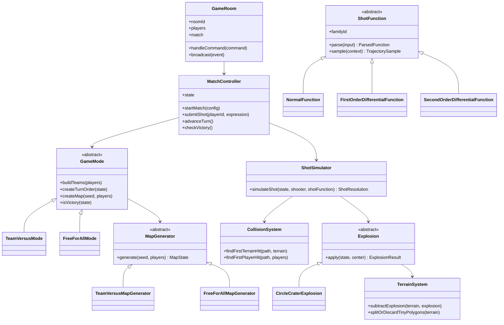

# Graphwar Discord Activity Design

## Status

Approved on 2026-07-04.

This design covers a local-first networked prototype for a Graphwar-like Discord Activity game. The first milestone runs locally in multiple browser tabs, but its architecture is shaped so it can later run inside Discord's Activity iframe wrapper with minimal changes to game logic.

## Source Context

The workspace currently contains `graphwar_cheat_sheet.md`, which defines the core Graphwar rules used for this design:

- Cartesian field with approximately `x = -25..25` and `y = -15..15`.
- Normal Function mode is the first supported shot type.
- Function shots are translated so they pass through the shooting soldier.
- Functions can explode or fail when undefined or too long.
- Future modes include first-order and second-order differential equation shots.

Discord Activity constraints checked against current Discord documentation:

- Activities are web apps hosted in iframes and communicate with Discord through the Embedded App SDK.
- Discord multiplayer Activities expose an `instanceId`; all players in the same Activity instance receive the same id.
- Discord Activity networking routes through the Discord proxy. WebSockets are supported; WebRTC is not currently supported.
- Local Discord Activity development can use localhost or a tunnel, but production uses URL mappings and Discord's proxy.

Reference links:

- Discord Activities overview: https://docs.discord.com/developers/activities/overview
- Building your first Activity: https://docs.discord.com/developers/activities/building-an-activity
- Activity networking guide: https://docs.discord.com/developers/activities/development-guides/networking
- Activity multiplayer guide: https://docs.discord.com/developers/activities/development-guides/multiplayer-experience
- Activity local development guide: https://docs.discord.com/developers/activities/development-guides/local-development

## Goals

- Build a local multiplayer prototype first.
- Keep the runtime shape compatible with a future Discord Activity.
- Support multiple browser tabs as mock clients connected to the same local server by `ip:port`.
- Support two match modes in the MVP:
  - Team Versus: two teams, initially 1-3 players per team, one soldier per player.
  - Free For All: each player fights independently, one soldier per player.
- Make map generation mode-specific.
- Implement destructible terrain in the first milestone.
- Keep server-side simulation authoritative.
- Start with Normal Function shots only.
- Make future shot/function families pluggable without changing the match controller.
- Make future explosion/terrain-removal styles pluggable without changing the match controller.
- Provide a math input palette for common snippets and functions.

## Non-Goals For The First Prototype

- Full Discord launch, OAuth, and production URL mapping integration.
- Mobile-specific UI polish.
- Matchmaking or public room discovery.
- Persistence across server restarts.
- First-order or second-order differential equation shot support.
- Terrain update compression. The MVP can broadcast the full updated terrain because the map state is small.
- Anti-cheat beyond server-authoritative simulation.
- Turn timers.
- Graphwar chat commands such as `-skip`, `-sayfunc`, and `-shownext`.

## Recommended Stack

Use a TypeScript monorepo.

### `apps/client`

Responsibilities:

- Vite client app.
- React UI shell.
- Canvas-based game renderer.
- Lobby and match HUD.
- Math input palette.
- WebSocket client.
- Animation playback from server events.
- Local mock-session adapter.
- Future Discord-session adapter using `@discord/embedded-app-sdk`.

Recommended libraries:

- `vite`
- `react`
- `typescript`
- `zustand`
- `@discord/embedded-app-sdk`
- `playwright` for browser smoke tests

Rendering should start with the built-in Canvas 2D API. PixiJS can be considered later if particles, camera work, or render performance become meaningfully complex.

### `apps/server`

Responsibilities:

- Node HTTP and WebSocket server.
- Room lifecycle.
- Mock local identity/session handling.
- Future Discord session verification adapter.
- Authoritative game state.
- Function parsing and sampling.
- Shot simulation.
- Collision detection.
- Terrain destruction.
- Damage, elimination, turn order, and victory.
- Broadcasting snapshots and animation events.

Recommended libraries:

- `fastify`
- `ws`
- `typescript`
- `zod`
- `vitest`
- `expr-eval` or `mathjs` for expression parsing
- `polygon-clipping` or `martinez-polygon-clipping` for subtracting crater polygons from terrain

### `packages/shared`

Responsibilities:

- Shared TypeScript domain types.
- Protocol command/event types.
- Zod schemas for network validation.
- Geometry primitives.
- Constants for field limits, sampling, damage, and defaults.

This package must not depend on browser-only or server-only APIs.

## Install And Run

Initial install:

```bash
npm install
```

Recommended root scripts:

```json
{
  "dev": "concurrently \"npm:dev:server\" \"npm:dev:client\"",
  "dev:server": "npm --workspace apps/server run dev",
  "dev:client": "npm --workspace apps/client run dev",
  "test": "vitest run",
  "check": "tsc -b",
  "test:e2e": "playwright test"
}
```

Local manual lobby testing:

```txt
http://localhost:5173/?room=local-test&mockPlayer=alice
http://localhost:5173/?room=local-test&mockPlayer=bob
http://localhost:5173/?room=local-test&mockPlayer=charlie
```

Each tab joins the same WebSocket room but uses a different mock player identity. This simulates the future Discord lobby shape without requiring Discord integration during the first game-loop milestone.

## Runtime Shape

The local prototype uses:

- Client URL query parameter `room` as the room key.
- Client URL query parameter `mockPlayer` as the local identity.
- WebSocket path such as `/rooms/:roomId`.

The future Discord Activity uses:

- `discordSdk.instanceId` as the room key.
- Discord authenticated user information as the player identity.
- The same WebSocket protocol after the session adapter has produced a verified `PlayerSession`.

The game server should not need to know whether a player came from a mock local tab or Discord once the session adapter has created a `PlayerSession`.

## MVP Constants

Initial constants should be easy to tune, but the first implementation should use concrete defaults:

```ts
const fieldBounds = {
  minX: -25,
  maxX: 25,
  minY: -15,
  maxY: 15
};

const defaultMatchTuning = {
  soldierHp: 100,
  playerHitRadius: 0.35,
  directHitDamage: 35,
  circleCraterRadius: 1.25,
  terrainMinArea: 0.05,
  sampleStep: 0.05,
  maxPathPoints: 2000
};
```

MVP damage is direct-hit only. A function path that contacts a player deals `directHitDamage`. A function path that contacts terrain creates a crater but does not apply splash damage to nearby players. Splash damage can be added later as another `Explosion` behavior.

## Authoritative Simulation

The server is the only authority for:

- Turn validation.
- Function parsing.
- Function validation.
- Function sampling.
- Local-to-world trajectory conversion.
- Terrain collision.
- Player collision.
- Terrain destruction.
- Damage and elimination.
- Turn advancement.
- Victory checks.

The client only:

- Renders state.
- Provides editing helpers.
- Sends player commands.
- Animates server-resolved events.
- Reconciles to authoritative snapshots.

## Client Commands

Initial command set:

```ts
type ClientCommand =
  | JoinRoomCommand
  | SelectModeCommand
  | SetTeamCommand
  | StartMatchCommand
  | SubmitShotCommand
  | SendChatCommand
  | RequestRematchCommand;
```

Command responsibilities:

- `JoinRoomCommand`: enters a room using mock or future Discord identity.
- `SelectModeCommand`: host selects `team-versus` or `free-for-all`.
- `SetTeamCommand`: player selects or changes team in team mode.
- `StartMatchCommand`: host starts the match.
- `SubmitShotCommand`: active player submits expression and function family id.
- `SendChatCommand`: optional chat or system command channel.
- `RequestRematchCommand`: restarts after a match ends.

## Server Events

Initial event set:

```ts
type ServerEvent =
  | RoomSnapshotEvent
  | PlayerJoinedEvent
  | PlayerLeftEvent
  | MatchStartedEvent
  | TurnStartedEvent
  | ShotAcceptedEvent
  | ShotRejectedEvent
  | ShotResolvedEvent
  | TerrainChangedEvent
  | PlayerDamagedEvent
  | PlayerEliminatedEvent
  | TurnAdvancedEvent
  | MatchEndedEvent;
```

`ShotResolvedEvent` should contain the ordered animation and reconciliation data:

- Shooter id.
- Function family id.
- Raw expression.
- World-space sampled path.
- Impact reason:
  - `terrain-hit`
  - `player-hit`
  - `undefined-function`
  - `path-too-long`
  - `field-boundary`
  - `miss`
- Impact point when available.
- Explosion event when applicable.
- Updated terrain or terrain diff. MVP uses full updated terrain.
- Damage events.
- Eliminations.
- Resulting turn state.
- Resulting match snapshot.

## Match Flow

Normal shot flow:

1. Active client sends `SubmitShotCommand`.
2. Server checks that it is that player's turn.
3. Server resolves the function family from `FunctionRegistry`.
4. `NormalFunction` parses the expression.
5. `NormalFunction` validates that the shot can start at local `(0, 0)`.
6. `NormalFunction` samples the path in shooter-local coordinates.
7. Server converts local path points into world coordinates.
8. `ShotSimulator` finds the first terrain hit, player hit, invalid sample, field-boundary exit, or miss.
9. If terrain is hit, `CircleCraterExplosion` removes a circular chunk from terrain polygons.
10. If a player is hit, the server applies damage and possible elimination.
11. `MatchController` advances the turn or ends the match.
12. Server broadcasts `ShotResolvedEvent`.
13. Clients animate the path, impact, particles, terrain update, damage UI, and turn change.
14. Clients reconcile to the authoritative snapshot included in the event.

## Coordinate Frame

Player input uses shooter-local coordinates, not absolute map coordinates.

For Normal Function mode, a player enters a function as if the shooter is at local `(0, 0)`.

World conversion:

```ts
type LocalPoint = { x: number; y: number };
type WorldPoint = { x: number; y: number };

function localToWorld(localPoint: LocalPoint, shooterPosition: WorldPoint): WorldPoint {
  return {
    x: shooterPosition.x + localPoint.x,
    y: shooterPosition.y + localPoint.y
  };
}
```

MVP shots are translated but not rotated. Local `+x` maps to global `+x`. A future aiming/facing system can add rotation to the local frame, especially for free-for-all.

## Normal Function Behavior

The MVP supports only Normal Function shots.

Players submit expressions interpreted as:

```txt
y = f(x)
```

The game vertically shifts the function so it starts at the shooter-local origin:

```ts
const offset = -f(0);
const localY = f(localX) + offset;
```

Example:

```txt
f(x) = x^2 + 5
f(0) = 5
localY = x^2 + 5 - 5
localY = x^2
```

This means a raw function does not need to cross the origin. It only needs a finite local y-intercept, `f(0)`, so the server can compute the vertical offset.

## Function Validation Settings

Function validation should be configurable at match creation.

```ts
type InvalidFunctionBehavior = "reject" | "explode-at-shooter";

type FunctionValidationSettings = {
  requireFiniteLocalYIntercept: boolean;
  requireRawXIntercept: boolean;
  invalidFunctionBehavior: InvalidFunctionBehavior;
};
```

MVP defaults:

```ts
const defaultFunctionValidationSettings: FunctionValidationSettings = {
  requireFiniteLocalYIntercept: true,
  requireRawXIntercept: false,
  invalidFunctionBehavior: "reject"
};
```

Rules:

- If parsing fails, reject the shot by default.
- If `f(0)` is undefined, infinite, or `NaN`, reject the shot by default.
- If path samples become undefined after launch, the shot explodes at the last finite sampled point.
- If no finite point exists after the origin, apply `invalidFunctionBehavior`.
- If path length exceeds `maxPathPoints`, the shot explodes at the last sampled point.
- `requireRawXIntercept` remains off by default because auto-shift already makes the shot start at the shooter.

## Function Input UX

The client should provide a math palette near the input box.

Basic buttons:

- `sin()`
- `cos()`
- `tan()`
- `sqrt()`
- `log()`
- `ln()`
- `abs()`
- `exp()`
- `x`
- `^`
- `()`

Template buttons:

- `a*sin(b*x+c)`
- `k/(1+exp(-a*(x+c)))`
- `k/(1+(a*(x-c))^2)`
- `a*((x-k)+abs(x-k))`

Snippet behavior:

- Snippets insert at the current cursor.
- Function snippets place the cursor inside parentheses.
- The palette is only an editing helper. The server still receives and parses raw text.

Example:

```txt
Before: 2+|
Click: sin()
After: 2+sin(|)
```

## Terrain

Terrain is represented as one or more polygon blobs in world coordinates.

```ts
type Point = { x: number; y: number };
type PolygonRing = Point[];

type TerrainBlob = {
  id: string;
  outer: PolygonRing;
  holes: PolygonRing[];
};

type TerrainState = {
  blobs: TerrainBlob[];
};
```

Terrain is destructible in the first milestone.

The MVP terrain destruction operation is:

1. Detect the impact point.
2. Build a circular crater polygon around the impact point.
3. Subtract the crater polygon from every intersecting terrain blob.
4. Keep resulting polygons above a minimum area.
5. Discard tiny fragments.
6. Broadcast the updated terrain.

## Explosions

Explosion behavior is pluggable.

```ts
abstract class Explosion {
  abstract readonly type: string;
  abstract apply(state: MatchState, center: WorldPoint): ExplosionResult;
}
```

MVP:

```ts
class CircleCraterExplosion extends Explosion {
  readonly type = "circle-crater";

  constructor(
    private readonly radius: number,
    private readonly damage: number
  ) {
    super();
  }
}
```

Future explosion types can remove different shapes, affect terrain differently, apply splash damage, chain explosions, or create delayed effects without changing `MatchController`.

## Game Modes

Game mode owns mode-specific rules.

```ts
abstract class GameMode {
  abstract readonly id: string;
  abstract buildTeams(players: Player[]): TeamState[];
  abstract createTurnOrder(state: MatchState): PlayerId[];
  abstract createMap(seed: string, players: Player[]): MapState;
  abstract isVictory(state: MatchState): VictoryResult;
}
```

### Team Versus

Rules:

- Two teams.
- 1-3 players per team for MVP.
- One soldier per player.
- Team assignment happens in the lobby.
- Victory occurs when all soldiers on one team are eliminated.
- Turn order alternates teams when possible.

Map generation:

- Left/right spawn regions.
- Team A starts on negative x.
- Team B starts on positive x.
- Terrain generation uses mirrored or explicitly balanced blobs across the y-axis.
- Cover should create lanes and obstruction without trapping players at spawn.

### Free For All

Rules:

- Each player is their own team.
- One soldier per player.
- Victory occurs when one player remains alive.
- Turn order cycles through living players.

Map generation:

- Spawn points distributed around the map.
- Terrain uses radial or scattered blobs rather than team-lane mirroring.
- Cover should avoid giving one spawn a strong deterministic advantage.

## Class Structure



Important boundaries:

- `MatchController` does not know how specific function families work.
- `ShotFunction` implementations own parsing and sampling.
- `FunctionRegistry` chooses a `ShotFunction` by family id.
- `GameMode` owns team and free-for-all differences.
- `MapGenerator` owns mode-specific terrain and spawn generation.
- `Explosion` implementations own terrain removal and damage style.
- `ShotSimulator` produces a `ShotResolution` with ordered events.
- Clients animate `ShotResolution`; they do not decide outcomes.

## Suggested File Structure

```txt
apps/
  client/
    src/
      app/
      game-renderer/
      hud/
      input/
      networking/
      sessions/
        localSession.ts
        discordSession.ts
  server/
    src/
      rooms/
      sessions/
      match/
      modes/
      maps/
      functions/
      simulation/
      terrain/
      protocol/
packages/
  shared/
    src/
      geometry/
      protocol/
      state/
      constants/
      validation/
```

## Testing Strategy

Unit tests:

- `NormalFunction` parsing.
- Finite `f(0)` validation.
- Vertical offset through local `(0, 0)`.
- Local-to-world coordinate conversion.
- Terrain crater subtraction.
- Tiny terrain fragment discard.
- Terrain hit detection.
- Player hit detection.
- Miss and field-boundary handling.
- Invalid function rejection.
- Turn advancement.
- Team versus victory.
- Free-for-all victory.
- Team versus map generation invariants.
- Free-for-all map generation invariants.

Integration tests:

- Two mock WebSocket clients join one room.
- Host starts a team match.
- Active player submits a valid function.
- Both clients receive the same `ShotResolvedEvent`.
- Server state changes exactly once.

End-to-end smoke test:

- Launch server and client.
- Open two mock-player tabs.
- Join the same room.
- Start a match.
- Submit `sin(x)`.
- Verify path animation event is received.
- Verify terrain/player UI reconciles to the server snapshot.

## Deferred Tuning

These are intentionally deferred beyond the first implementation plan:

- Whether free-for-all should rotate the shooter-local frame by aiming direction.
- Damage, crater radius, hit radius, and sample-step balance after playtesting the defaults.
- Terrain generator parameter tuning after the first playable lobby tests.
