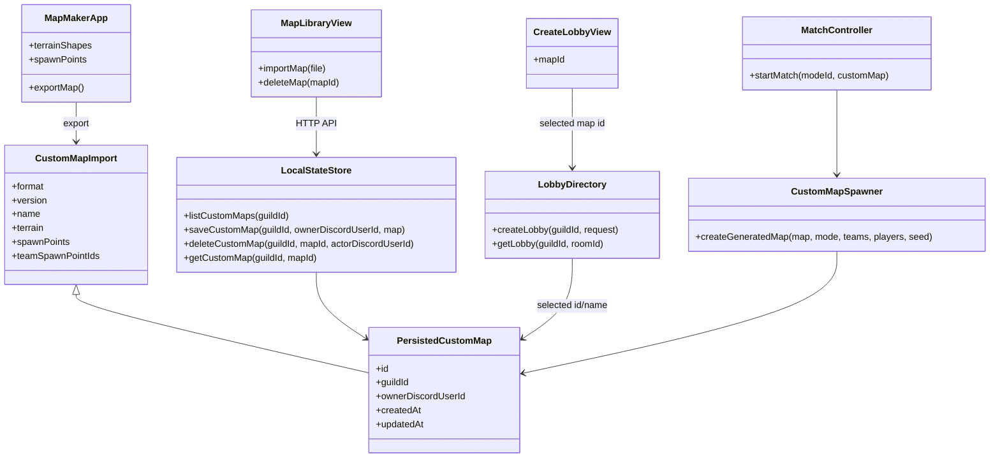

# Custom Maps And Map Maker Design

Date: 2026-07-06

## Goal

Add guild-scoped custom maps to the local Graphwar Discord Activity prototype and build a separate local Electron map maker that exports maps in the same format the game can import. The playable client remains the Discord Activity-shaped browser client. The map maker is a local desktop tool, not a web editor.

## User Directives

- Add a load custom maps button in the main menu.
- Build the custom map maker now.
- Keep the game UI inside a Discord Activity 16:9 viewport with no page scrolling.
- Hide nonessential UI when it is not relevant.
- Maps are guild-scoped. A lobby in one Discord server must not see another server's maps.
- Persist maps permanently in the local server state.
- Track the Discord user id that added a map. Only that user can delete it.
- Default generated maps must keep working.
- Custom maps must support team-versus and free-for-all spawn assignment.
- Team-versus maps can mark generic spawn points as Team A or Team B spawns.
- Free-for-all maps assign players to maximally separated spawn points.
- Terrain remains polygon blobs on the Cartesian plane.
- Terrain destruction remains server-side and should operate on loaded custom-map terrain without special cases.
- Commit and push every big change, update README on every push, and do not add `Co-Authored-By` trailers.

## Recommended Flow

1. Define one shared custom map format and Zod validation.
2. Persist custom maps per guild on the server.
3. Add game client map library UI from the main menu:
   - list custom maps for the current guild
   - import `.graphwar-map.json`
   - delete maps owned by the current Discord user
4. Add map selection to create lobby:
   - Default Map
   - custom guild maps
5. Start matches with the selected map when present.
6. Build the Electron map maker against that exact export format.

This order makes the game able to load maps before the editor is fully polished, while ensuring the editor exports something immediately useful.

## Shared Map Contract

Custom map import payload:

```ts
export type CustomMapImport = {
  format: "graphwar-map";
  version: 1;
  name: string;
  worldBounds?: {
    minX: number;
    maxX: number;
    minY: number;
    maxY: number;
  };
  terrain: TerrainState;
  spawnPoints: CustomMapSpawnPoint[];
  teamSpawnPointIds: {
    "team-a": string[];
    "team-b": string[];
  };
};

export type CustomMapSpawnPoint = {
  id: string;
  position: WorldPoint;
};
```

Persisted server map:

```ts
export type PersistedCustomMap = CustomMapImport & {
  id: string;
  guildId: GuildId;
  ownerDiscordUserId: DiscordUserId;
  createdAt: string;
  updatedAt: string;
};
```

Validation rules:

- `format` must be `graphwar-map`.
- `version` must be `1`.
- `name` must be nonempty and compact enough for the Discord view.
- Terrain blobs must have valid ids and outer rings with at least 3 points.
- Holes are allowed because `TerrainBlob` already supports them, though the first editor version may not expose hole editing.
- Spawn point ids must be unique.
- A saved custom map must have at least 10 generic spawn points.
- Team spawn ids must refer to existing generic spawn points.
- Team spawn lists may be empty at import time, but team-versus match start is blocked if the selected map cannot spawn the current teams.

## Server Persistence

Extend `PersistedServerState.guilds[guildId]`:

```ts
{
  settings: GuildSettings;
  leaderboard: Record<DiscordUserId, PlayerStatsEntry>;
  customMaps: Record<string, PersistedCustomMap>;
}
```

`LocalStateStore` gains:

```ts
listCustomMaps(guildId): Promise<PersistedCustomMap[]>
saveCustomMap(guildId, ownerDiscordUserId, map): Promise<PersistedCustomMap>
deleteCustomMap(guildId, mapId, actorDiscordUserId): Promise<void>
getCustomMap(guildId, mapId): Promise<PersistedCustomMap | undefined>
```

Existing state files are migrated lazily by using `customMaps: {}` when a guild record does not have the field.

## HTTP API

Add guild-scoped map endpoints:

```txt
GET    /guilds/:guildId/maps
POST   /guilds/:guildId/maps
DELETE /guilds/:guildId/maps/:mapId?actorDiscordUserId=...
```

`POST` body:

```ts
{
  ownerDiscordUserId: DiscordUserId;
  map: CustomMapImport;
}
```

`DELETE`:

- succeeds only if the actor owns the map
- returns `403` with a `forbidden` error code otherwise
- CORS allowed methods must include `DELETE`

## Lobby Integration

Extend create lobby:

```ts
export type CreateLobbyRequest = {
  name: string;
  leaderDiscordUserId: DiscordUserId;
  alias: string;
  mode: MatchModeId;
  initialSlot: LobbySlot;
  mapId?: string;
};
```

Runtime lobby snapshot and lobby summaries include:

```ts
mapId?: string;
mapName?: string;
```

The lobby directory stores only the selected map id/name. The authoritative map payload is loaded from `LocalStateStore` when the leader starts the match.

## Match Start Integration

`MatchController.startMatch` accepts an optional generated map:

```ts
startMatch(modeId: MatchModeId, customMap?: GeneratedMap): MatchState
```

Default behavior stays unchanged when `customMap` is not provided.

Custom-map spawn assignment is converted into the existing `GeneratedMap` shape before calling the match controller:

```ts
export type GeneratedMap = {
  spawns: Array<{ playerId: PlayerId; position: WorldPoint }>;
  terrain: TerrainState;
};
```

### Team-Versus Spawn Assignment

- Team A players sample from `teamSpawnPointIds["team-a"]`.
- Team B players sample from `teamSpawnPointIds["team-b"]`.
- Sampling is deterministic from room id, player ids, and map id.
- Start is blocked if either team has fewer usable team spawns than active players.

### Free-For-All Spawn Assignment

- Start with a deterministic random spawn.
- Repeatedly choose the candidate spawn that maximizes distance to the nearest already selected spawn.
- Tie-break deterministically.
- Start is blocked if the custom map has fewer spawn points than active players.

## Client UI

Main menu adds a compact secondary button:

```txt
Custom Maps
```

The map library view must fit inside the Discord 16:9 shell:

- header with guild id and back button
- import map button using a hidden file input
- compact list of maps: name, owner, created date, delete button if owned
- empty state when no custom maps exist
- no game HUD or lobby setup controls on this screen

Create lobby gains a compact map selector:

```txt
Map
  Default Map
  <guild custom map names>
```

If map loading fails, the selector remains usable with `Default Map` and shows a short warning.

## Electron Map Maker

Create a new workspace:

```txt
apps/map-maker
```

Planned stack:

- Electron for the desktop shell
- Vite + React for renderer UI
- Canvas 2D for the editor surface
- Shared map schemas/types from `@graphwar/shared`
- No separate web app

First version tools:

- Select/move tool
- Rectangle terrain tool
- Triangle terrain tool
- Circle terrain tool, exported as a polygon ring
- Pen terrain tool
- Spawn tool
- Team assignment tool

Pen behavior:

- Left click adds a point.
- Consecutive points show live line segments.
- Clicking the first point with at least 3 points closes the polygon.
- Right click removes the most recent point after the first point.

Transform behavior:

- Shapes can be selected and dragged.
- A selected shape shows a bounding box.
- Dragging a corner scales the selected shape in x/y, similar to a simple transform box.
- Spawn points can be dragged.

Team spawn behavior:

- User places generic spawn points first.
- Team assignment mode clicks existing spawn points to assign Team A, Team B, or neutral.
- Saved map stores generic spawn points plus team spawn subsets.

Export behavior:

- Export validates at least 10 spawn points.
- Export warns, but does not block, if Team A or Team B spawn subsets are empty.
- Export writes `.graphwar-map.json`.
- The game client imports that file through the Custom Maps menu.

## Architecture Sketch



## Testing Strategy

Use test-driven development for behavior changes.

Shared tests:

- custom map schema accepts a valid map
- rejects fewer than 10 spawn points for server save
- rejects duplicate spawn ids
- rejects team spawn ids that do not exist

Server tests:

- state store persists maps per guild
- delete rejects non-owner
- list maps is guild-scoped
- create lobby stores selected map id/name
- team-versus start blocks insufficient team spawns
- free-for-all spawn selection maximizes separation deterministically
- custom map terrain appears in the match snapshot

Client tests:

- main menu exposes Custom Maps
- map library imports a valid JSON file
- owned map delete calls the API
- create lobby can select a custom map id

Electron map maker tests:

- editor model creates standard shapes
- pen tool closes polygons and undoes points
- transform scales selected terrain
- export validates spawn count
- exported JSON passes shared schema validation

E2E smoke:

- Alice imports a map.
- Alice creates a lobby using that map.
- Bob joins.
- Alice starts the match.
- The match terrain/spawns come from the imported map.

## Risks And Choices

- Electron installation adds a new dev dependency and may require network access.
- The first editor version should prioritize correct exported data over visual polish.
- Direct publish from Electron to the local server is intentionally deferred. File export/import is simpler and matches the future Discord Activity boundary better.
- Holes in terrain are supported by the shared type but not exposed in the first editor UI.
- Custom maps should not change shot simulation. Once terrain is loaded into `TerrainState`, existing collision and crater logic owns the result.
